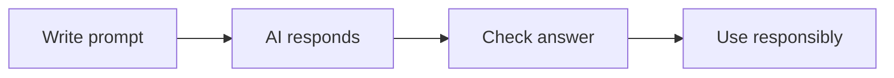

# 🤖 AI Awareness

*Grade 2 — Computer Discovery*

*A careful AI workflow*

Topics covered this grade:

- **What is AI? Simple examples from everyday life**
- **AI as a computer technology**
- **Basic safety and asking an adult/teacher before using AI tools**

---

### 💡 What is AI? Simple examples from everyday life

**Concept:** AI, or Artificial Intelligence, is a special type of computer program that helps machines 'think' or make helpful choices for us.

**Example:** When a tablet recognizes your face to unlock, or a video app guesses which cartoon you want to watch next, that is AI working.

**Why it matters:** AI is in many of the toys and tools we use, so it is good to know when a machine is helping you.

**Did you know?** AI isn't a robot with a brain! It is just a very fast computer doing lots of math behind the scenes.

---

### 💡 AI as a computer technology

**Concept:** AI is a tool made by smart people who write code to help computers solve problems and learn from information.

**Example:** Just like a student learns math from a book, an AI learns how to play chess by looking at thousands of past games.

**Why it matters:** Understanding that AI is just a tool helps us remember that humans are the ones really in charge.

**Did you know?** Computers do not have feelings or magical powers. They only know what humans have taught them.

---

### 💡 Basic safety and asking an adult/teacher before using AI tools

**Concept:** Always ask a trusted adult before using any AI tool, just like you ask before going to a new website or opening a new app.

**Example:** If you want to use a fun website that draws silly pictures using AI, check with your teacher first to make sure it is safe.

**Why it matters:** Some AI tools ask for your name or pictures, and we always want to keep our personal information safe and private.

**Did you know?** Even if an AI talks to you like a friend, it is still a machine. Never tell it secrets or where you live!

## Review

<FlashcardDeck cards={[{"front":"What is AI? Simple examples from everyday life","back":"AI, or Artificial Intelligence, is a special type of computer program that helps machines 'think' or make helpful choices for us."},{"front":"AI as a computer technology","back":"AI is a tool made by smart people who write code to help computers solve problems and learn from information."},{"front":"Basic safety and asking an adult/teacher before using AI tools","back":"Always ask a trusted adult before using any AI tool, just like you ask before going to a new website or opening a new app."}]} />
