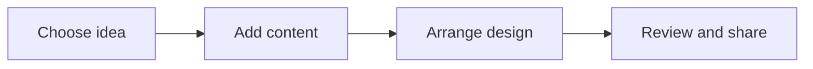

# 🎨 Canva & Creativity

*Grade 2 — Computer Discovery*

*How a design comes together*

Topics covered this grade:

- **Simple templates**
- **Adding text and images**
- **Basic posters, cards and visual stories**

---

### ⚙️ Simple templates

*Start your art with a beautiful background that is already made for you.*

1. **Open Canva and look at the top for the search bar.** Type in 'Poster' or 'Card' to find what you want to make.
2. **Scroll down slowly to look at all the colorful choices.** These choices are called 'templates' and they are like coloring pages.
3. **Click on the picture that you like the best.** It will open up really big so you can start working on it.
4. **Click on any word on the template to change it to your own words.** You can erase their words and type your name instead.
5. **Save or finish the activity.** Use the File menu or the activity button, then wait for confirmation that the work is complete.

💡 **Tip:** Look for templates that don't have a small crown on them. The crown means you have to pay for it!

---

### ⚙️ Adding text and images

*Make the poster your own by adding new words and fun pictures.*

1. **Click the 'Text' button on the left side of the screen.** It looks like a big letter 'T'.
2. **Click 'Add a heading' and type a big, bold word.** Try typing 'Happy Birthday' or 'Welcome to my room'.
3. **Click the 'Elements' button to find pictures.** It has a picture of a square and a circle on it.
4. **Type a word like 'sun' or 'cat' in the search bar at the top.** Canva will show you hundreds of pictures of suns and cats!
5. **Click a picture and drag it onto your beautiful design.** You can use the corners to make the cat tiny or huge.

💡 **Tip:** Don't add too many pictures! Leave some empty space so people can read your words.

---

### 💡 Basic posters, cards and visual stories

**Concept:** You can use Canva to make colorful posters for your bedroom wall or sweet cards for your friends and family.

**Example:** Creating a 'Happy Mother's Day' card with beautiful flowers and a picture of you is a great Canva project.

**Why it matters:** Making things yourself is much more special than buying them from a store. In Grade 2, connect this idea to a small project so you can see it working instead of only memorising a definition.

**Did you know?** You don't even need crayons or markers to be an artist! Digital art is just as creative as drawing on paper.

## Review

<FlashcardDeck cards={[{"front":"Basic posters, cards and visual stories","back":"You can use Canva to make colorful posters for your bedroom wall or sweet cards for your friends and family."}]} />
