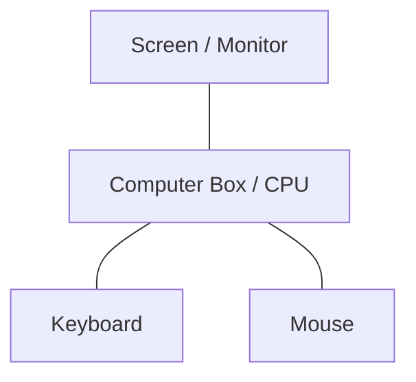

# 🖥️ Computer Foundations

*Grade 2 — Computer Discovery*

*The main parts of a computer*

Topics covered this grade:

- **What is a computer?**
- **Common computer devices**
- **Monitor, keyboard, mouse and basic parts**
- **Turning a computer on/off**
- **Mouse skills; clicking, dragging and selecting**
- **Basic keyboard use**
- **Opening and closing programs**

---

### 💡 What is a computer?

**Concept:** A computer is a smart electronic machine that follows our instructions. We can use it to help us learn new things, play fun games, and create beautiful art.

**Example:** The big machine sitting on your desk with a bright screen and a keyboard is a computer. A tablet is also a type of computer.

**Why it matters:** Computers are all around us and help people do their jobs every single day.

**Did you know?** Did you know that computers used to be as big as an entire room? Now they can fit in your pocket!

---

### 💡 Common computer devices

**Concept:** Computers come in many different shapes and sizes to do different jobs. Some are heavy and stay on a desk, while others are light and can be carried around.

**Example:** A tablet you use to play games at home and the laptop your teacher uses in class are both computer devices.

**Why it matters:** Knowing the different types helps you pick the right tool for the job you want to do.

**Did you know?** A phone is actually a very powerful small computer, not just a device for calling people!

---

### 💡 Monitor, keyboard, mouse and basic parts

**Concept:** A computer has different parts that work together as a team. The monitor shows pictures, the keyboard has buttons for typing, and the mouse helps us point at things.

**Example:** Think of the monitor like a television screen. The keyboard is like a board full of letter buttons.

**Why it matters:** You need to know what each part does so you can use the computer properly.

**Did you know?** The 'mouse' on your desk doesn't eat cheese! It got its name because the wire looks like a long tail.

---

### ⚙️ Turning a computer on/off

*Learn how to wake up your computer and put it to sleep safely.*

1. **Look for the power button on the computer case or monitor.** It is usually a round button with a circle and a line through it.
2. **Press the button once gently and wait for the screen to light up.** Do not push it hard or hold it down, just a quick tap is enough.
3. **To turn it off, click the 'Start' button at the bottom of the screen.** This looks like a small window or a colorful flag.
4. **Click the 'Power' icon, and then click 'Shut down'.** Wait patiently until the screen goes completely black before walking away.
5. **Save or finish the activity.** Use the File menu or the activity button, then wait for confirmation that the work is complete.

💡 **Tip:** Never pull the plug out of the wall to turn off your computer!

---

### ⚙️ Mouse skills; clicking, dragging and selecting

*Practice using the mouse to control what happens on the screen.*

1. **Rest your hand gently on the mouse with your fingers pointing forward.** Your index finger should sit lightly on the left button.
2. **Move the mouse slowly on the desk to see the pointer move on the screen.** If you run out of space on the desk, lift the mouse up and move it back.
3. **Click the left button once very quickly to select an item.** This makes a short 'click' sound, like tapping a button.
4. **Click and hold the button down to 'grab' an item.** Keep your finger pushed down on the button.
5. **Move the mouse while holding the button to move the item (dragging).** Let go of the button when the item is exactly where you want it.

💡 **Tip:** Don't squeeze the mouse tightly! Hold it gently like a small egg.

---

### 💡 Basic keyboard use

**Concept:** The keyboard is the tool we use to type letters, numbers, and instructions into the computer. It has many rows of keys that you press with your fingers.

**Example:** You can use the keyboard to type your name into a story or to search for a fun video.

**Why it matters:** Using the keyboard is the fastest way to write words on a computer screen.

**Did you know?** The letters on the keyboard are not in ABC order! They are arranged in a special way to make typing easier.

---

### ⚙️ Opening and closing programs

*Start the apps you want to use and close them when you are done.*

1. **Find a small picture on the screen for the program you want to use.** These small pictures are called 'icons' and they sit on your desktop.
2. **Move your mouse pointer exactly over the icon.** Make sure the tip of the arrow is touching the picture.
3. **Double-click the left mouse button very quickly.** Click two times fast, like a quick heartbeat: tap-tap!
4. **Wait a moment for the program window to open up.** Sometimes computers need a few seconds to think, so be patient.
5. **To close it, click the small 'X' button in the top-right corner.** The 'X' is usually inside a red box to warn you that it will close.

💡 **Tip:** If double-clicking is hard, you can click the icon once and then press the 'Enter' key on the keyboard.

## Review

<FlashcardDeck cards={[{"front":"What is a computer?","back":"A computer is a smart electronic machine that follows our instructions."},{"front":"Common computer devices","back":"Computers come in many different shapes and sizes to do different jobs."},{"front":"Monitor, keyboard, mouse and basic parts","back":"A computer has different parts that work together as a team."},{"front":"Basic keyboard use","back":"The keyboard is the tool we use to type letters, numbers, and instructions into the computer."}]} />
