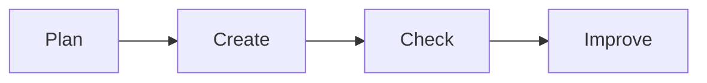

# 🗂️ Digital Skills

*Grade 2 — Computer Discovery*

*A simple digital work cycle*

Topics covered this grade:

- **Simple file awareness**
- **Saving and opening work with guidance**
- **Basic digital classroom rules**
- **Safe and responsible computer use**

---

### 💡 Simple file awareness

**Concept:** A 'file' is like a piece of paper on your computer. Every piece of work you do, like a drawing or a typed story, is saved as its very own file.

**Example:** If you draw a picture of a house, you save it as an image file. If you type your name, it is a document file.

**Why it matters:** If you do not understand files, you might lose the beautiful work you spent a long time making.

**Did you know?** Sometimes people think their work is gone forever when they close a program, but it is just hiding in a file safely on the computer!

---

### ⚙️ Saving and opening work with guidance

*Keep your work safe so you can look at it again tomorrow.*

1. **Look at the very top of your program for the word 'File' and click it.** This opens a menu with a list of things you can do.
2. **Move your mouse down and click the word 'Save'.** A new box will pop up asking you what to call your work.
3. **Use the keyboard to type a name, like 'My Dog Drawing'.** Always give it a name you will remember.
4. **Click the blue 'Save' button at the bottom of the box.** Now your work is safe on the computer.
5. **To see it again later, click 'File', then 'Open', and find your drawing's name.** Click on the name, and your drawing will appear on the screen!

💡 **Tip:** Save your work often, even before you are completely finished!

---

### 💡 Basic digital classroom rules

**Concept:** Digital rules are special instructions that help everyone stay safe and keep the computers working perfectly for the next class.

**Example:** One important rule is to always wash your hands before touching the keyboard, and another is to never run in the computer lab.

**Why it matters:** If we don't follow the rules, computers might get broken, and then nobody can play games or learn.

**Did you know?** Rules are not meant to stop you from having fun; they are meant to make sure the fun never stops!

---

### 💡 Safe and responsible computer use

**Concept:** Being responsible means you are gentle with the equipment, you share nicely, and you only visit websites that are safe for kids.

**Example:** Responsible students never have drinks near the keyboard, and they always tell a teacher if they see something strange on the screen.

**Why it matters:** Computers are expensive and fragile. Being responsible shows that you are grown up enough to use them.

**Did you know?** Some students think hitting the keys harder makes the computer work faster. It doesn't—it just breaks the keys!

## Review

<FlashcardDeck cards={[{"front":"Simple file awareness","back":"A 'file' is like a piece of paper on your computer."},{"front":"Basic digital classroom rules","back":"Digital rules are special instructions that help everyone stay safe and keep the computers working perfectly for the next class."},{"front":"Safe and responsible computer use","back":"Being responsible means you are gentle with the equipment, you share nicely, and you only visit websites that are safe for kids."}]} />
