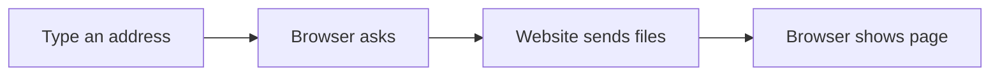

# 🌐 Internet Awareness

*Grade 2 — Computer Discovery*

*How a webpage reaches your screen*

Topics covered this grade:

- **What is the internet? What is a browser?**
- **Safe browsing with an adult/teacher**
- **Recognizing that not everything online is trustworthy**

---

### 💡 What is the internet? What is a browser?

**Concept:** The internet is a giant invisible web that connects computers all over the entire world. A browser is the special app we use to look at websites on that web.

**Example:** When you use Google Chrome or Microsoft Edge to play an online math game, you are using a browser to surf the internet.

**Why it matters:** Without the internet, computers would only know what is saved inside them. The internet lets them talk to each other.

**Did you know?** The internet doesn't float in the sky! It travels through huge cables buried deep under the ocean.

---

### 💡 Safe browsing with an adult/teacher

**Concept:** Safe browsing means you only visit websites that a trusted adult, like your teacher or parent, says are okay for kids.

**Example:** If a strange box pops up on your screen that you don't recognize, do not click it! Always raise your hand and ask your teacher for help.

**Why it matters:** Just like you wouldn't wander into a strange neighborhood alone, you shouldn't wander around the internet without an adult.

**Did you know?** A picture of a cute puppy doesn't mean a website is safe. Some unsafe sites use cute pictures to trick kids into clicking.

---

### 💡 Recognizing that not everything online is trustworthy

**Concept:** Just because you see a picture or read a story on a screen doesn't mean it is completely true. People can put anything on the internet.

**Example:** You might see a funny video of a dog driving a school bus. That is just for fun and movie magic, not a real dog driver!

**Why it matters:** If you believe everything you see online, you might learn things that are wrong and share them with your friends.

**Did you know?** Some people think that if a website looks beautiful, it must be true. But anyone can make a pretty website!

## Review

<FlashcardDeck cards={[{"front":"What is the internet? What is a browser?","back":"The internet is a giant invisible web that connects computers all over the entire world."},{"front":"Safe browsing with an adult/teacher","back":"Safe browsing means you only visit websites that a trusted adult, like your teacher or parent, says are okay for kids."},{"front":"Recognizing that not everything online is trustworthy","back":"Just because you see a picture or read a story on a screen doesn't mean it is completely true."}]} />
