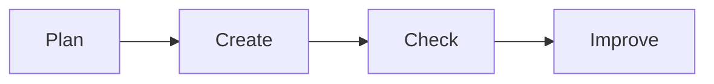

# 📊 Office Productivity

*Grade 2 — Computer Discovery*

*A simple digital work cycle*

Topics covered this grade:

- **Very basic word processing: typing words/sentences**
- **Simple formatting and adding a picture**
- **Introduction to simple presentations**

---

### ⚙️ Very basic word processing: typing words/sentences

*Write a short story or a sentence about yourself on the computer.*

1. **Open a writing program like Word or Google Docs from your desktop.** Look for an icon that looks like a blue 'W' or a blue piece of paper.
2. **Click inside the white page so you see a blinking line.** This blinking line tells you where your letters will appear.
3. **Use the keyboard to type a short sentence, like 'I like playing soccer.'** Take your time and look for each letter.
4. **Press the long 'Spacebar' at the bottom to put a space between words.** Without spaces, all your words will be stuck together!
5. **Press the 'Enter' key to move to a brand new line.** The 'Enter' key is a big button on the right side of the keyboard.

💡 **Tip:** If you make a mistake, press the 'Backspace' key to erase the last letter.

---

### ⚙️ Simple formatting and adding a picture

*Make your words look bold and add a picture to your page.*

1. **Use your mouse to click and drag over your text to highlight it in blue.** This tells the computer which words you want to change.
2. **Click the button with the big 'B' at the top of the screen.** Your letters will become thicker and darker. This is called 'Bold'.
3. **Click the word 'Insert' at the top, then click 'Picture'.** A menu will open to let you pick a photo.
4. **Find a picture of an animal or a car on the computer and click 'Open'.** The picture will pop right onto your page!
5. **Click the corners of the picture and drag to make it smaller or bigger.** Be careful not to squish the picture too much.

💡 **Tip:** You can also change the color of your words by clicking the button with an 'A' and a red line under it.

---

### 💡 Introduction to simple presentations

**Concept:** A presentation is a fun way to share your ideas using big pictures and a few huge words on pages called 'slides.'

**Example:** You can make a slide with a giant picture of your favorite dinosaur and type its name really big at the top.

**Why it matters:** Presentations help you show and tell your friends about what you are learning.

**Did you know?** A presentation slide is not meant for reading a whole book! It is just for showing cool pictures while you talk.

## Review

<FlashcardDeck cards={[{"front":"Introduction to simple presentations","back":"A presentation is a fun way to share your ideas using big pictures and a few huge words on pages called 'slides."}]} />
