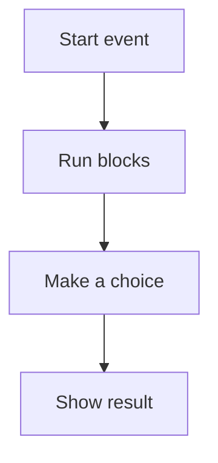

# 🐱 Scratch & Logic

*Grade 2 — Computer Discovery*

*How a Scratch program runs*

Topics covered this grade:

- **Sequencing activities**
- **Commands and instructions**
- **Scratch interface**
- **Sprites**
- **Simple movement and short animations**

---

### 💡 Sequencing activities

**Concept:** Sequencing means putting steps in the exact right order so a task gets done correctly.

**Example:** Think of brushing your teeth: first you get the brush, then you put on the paste, then you scrub. If you scrub before getting the brush, it won't work!

**Why it matters:** Computers are not very smart on their own. They need you to put instructions in the perfect sequence to work.

**Did you know?** Sometimes people think coding is just typing fast like in movies. It is actually more like writing a recipe very carefully.

---

### 💡 Commands and instructions

**Concept:** A command is a simple, direct instruction we give to a computer to make it do something specific.

**Example:** Telling a character in a game to 'Move 10 steps' or 'Turn around' is a command.

**Why it matters:** Without commands, computers would just sit there doing nothing at all. In Grade 2, connect this idea to a small project so you can see it working instead of only memorising a definition.

**Did you know?** You cannot tell a computer 'Go over there.' You have to give it a specific command like 'Move 50 steps right.'

---

### 💡 Scratch interface

**Concept:** The Scratch interface is the fun digital playground where we build our games and stories.

**Example:** It has a 'stage' where the characters act, and a 'toolbox' full of colorful code blocks on the left.

**Why it matters:** Knowing where all the tools are makes it much easier and faster to build your game. In Grade 2, connect this idea to a small project so you can see it working instead of only memorising a definition.

**Did you know?** The colors of the blocks actually mean something! Blue blocks are for moving, and purple blocks are for looking.

---

### 💡 Sprites

**Concept:** Sprites are the characters and objects in Scratch that we can control with our code commands.

**Example:** The orange cat you see when you open Scratch is the most famous sprite, but you can also use a dog, a car, or a wizard.

**Why it matters:** Sprites are the actors in your digital play. Without them, your code wouldn't have anything to move!

**Did you know?** You can even draw your very own sprite or take a picture of yourself to use as a sprite in your game.

---

### ⚙️ Simple movement and short animations

*Make your very first character move across the screen.*

1. **Click on the blue 'Motion' circle on the far left.** This opens up all the blocks that make things move.
2. **Click and drag a 'Move 10 steps' block into the big white workspace.** It will snap into place like a puzzle piece.
3. **Click the block with your mouse to see your sprite move on the stage.** Every time you click it, the sprite takes a tiny step forward.
4. **Drag a 'Turn 15 degrees' block and snap it under the 'Move' block.** Make sure they click together.
5. **Click the connected blocks to make your sprite step and spin!** You have just written your first computer program.

💡 **Tip:** If your sprite walks off the screen, you can just click on it in the stage and drag it back to the middle.

## Review

<FlashcardDeck cards={[{"front":"Sequencing activities","back":"Sequencing means putting steps in the exact right order so a task gets done correctly."},{"front":"Commands and instructions","back":"A command is a simple, direct instruction we give to a computer to make it do something specific."},{"front":"Scratch interface","back":"The Scratch interface is the fun digital playground where we build our games and stories."},{"front":"Sprites","back":"Sprites are the characters and objects in Scratch that we can control with our code commands."}]} />
