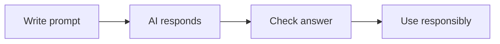

# 🤖 AI Awareness

*Grade 3 — Digital Explorer*

*A careful AI workflow*

Topics covered this grade:

- **What AI is; examples of AI around us**
- **Generative AI at a basic level**
- **What AI can and cannot do**
- **Safe and responsible use**

---

### 💡 What AI is; examples of AI around us

**Concept:** AI (Artificial Intelligence) is a type of computer programming that lets machines do tasks that usually require a human brain, like understanding speech or recognizing pictures.

**Example:** Smart speakers that answer your questions out loud, or map apps that automatically reroute around a traffic jam, are using AI.

**Why it matters:** AI is built into many of the tools and toys we use every day. Knowing how it works helps us use it better.

**Did you know?** AI does not 'think' the way humans do. It is just incredibly fast at spotting patterns in huge amounts of math and data.

---

### 💡 Generative AI at a basic level

**Concept:** Generative AI is a special kind of AI that can create brand new things from scratch, like writing stories, drawing pictures, or even composing music.

**Example:** If you ask a Generative AI to 'write a poem about a flying skateboard', it will instantly invent a poem that has never been written before.

**Why it matters:** Generative AI is a powerful tool for brainstorming. It can help you get started when you are feeling stuck on a creative project.

**Did you know?** When AI draws a picture, it isn't searching the internet for an image to copy. It is actually generating the pixels one by one!

---

### 💡 What AI can and cannot do

**Concept:** AI is amazing at processing information quickly, but it has no common sense, no feelings, and it cannot understand the real physical world.

**Example:** An AI can write a brilliant story about playing in the snow, but it doesn't actually know what cold snow feels like.

**Why it matters:** Because AI has no common sense, it can sometimes confidently give you an answer that is completely wrong or silly.

**Did you know?** Many people think AI is always right because it sounds very smart. But AI can 'hallucinate' and invent fake facts just to finish a sentence.

---

### 💡 Safe and responsible use

**Concept:** Using AI responsibly means you never share personal secrets with it, and you always use your own brain to double-check its work.

**Example:** If an AI tells you a historical fact for a school report, you should verify that fact in a trusted book before turning it in.

**Why it matters:** Companies often read the conversations people have with AI to improve the software, so anything you type is not truly private.

**Did you know?** Copying a story that an AI wrote and putting your name on it is not being a 'good prompt engineer'—it is plagiarism!

## Review

<FlashcardDeck cards={[{"front":"What AI is; examples of AI around us","back":"AI (Artificial Intelligence) is a type of computer programming that lets machines do tasks that usually require a human brain, like understanding speech or recognizing pictures."},{"front":"Generative AI at a basic level","back":"Generative AI is a special kind of AI that can create brand new things from scratch, like writing stories, drawing pictures, or even composing music."},{"front":"What AI can and cannot do","back":"AI is amazing at processing information quickly, but it has no common sense, no feelings, and it cannot understand the real physical world."},{"front":"Safe and responsible use","back":"Using AI responsibly means you never share personal secrets with it, and you always use your own brain to double-check its work."}]} />
