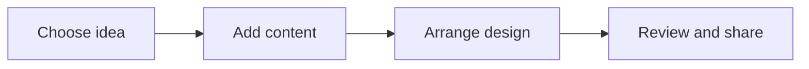

# 🎨 Canva & Creativity

*Grade 3 — Digital Explorer*

*How a design comes together*

Topics covered this grade:

- **Templates, text, images and elements**
- **Posters**
- **Invitations**
- **Book covers**
- **Simple visual storytelling**

---

### ⚙️ Templates, text, images and elements

*Combine different pieces to build a complete design in Canva.*

1. **Start by choosing a colorful template that fits your project.** For example, pick a space-themed template for a science report.
2. **Double-click on any text in the template to type your own words.** Change the font size if your words are too long and don't fit.
3. **Click the 'Elements' tab on the left to find stickers and shapes.** Type 'rocket' or 'stars' to find cool graphics to add.
4. **Click the 'Uploads' button to add a picture saved on your computer.** This is great for adding a picture of yourself to a poster.
5. **Drag all the pieces around until everything is perfectly balanced.** Make sure no text is covering up important parts of an image.

💡 **Tip:** Use the 'Undo' arrow at the top if you make a mistake and want to go backwards!

---

### 💡 Posters

**Concept:** Posters are large, eye-catching digital designs used to share important information or celebrate an event.

**Example:** You can create a colorful poster to invite your friends to a school science fair or remind people to recycle.

**Why it matters:** A good poster catches people's attention so they actually stop to read your message. In Grade 3, connect this idea to a small project so you can see it working instead of only memorising a definition.

**Did you know?** The best posters have very few words! A huge picture and a short, catchy title work much better than a wall of text.

---

### 💡 Invitations

**Concept:** Invitations are special digital cards used to ask people to come to a party, meeting, or gathering.

**Example:** You can design a birthday invitation with a fun superhero theme and all the details like time and place.

**Why it matters:** Sending a digital invitation is faster than mailing paper ones, and it saves trees! In Grade 3, connect this idea to a small project so you can see it working instead of only memorising a definition.

**Did you know?** Always remember to include the 'Who, What, Where, and When'. If you forget the 'Where', nobody will show up!

---

### 💡 Book covers

**Concept:** A book cover is a design that shows the title, the author's name, and a picture that gives a hint about the story.

**Example:** If you write a story about a haunted house, you can create a book cover with spooky dark colors and a glowing window.

**Why it matters:** People absolutely do judge books by their covers! A great cover makes people want to read your story.

**Did you know?** The cover shouldn't give away the ending of the story; it should just make the reader curious.

---

### 💡 Simple visual storytelling

**Concept:** Visual storytelling means using pictures, shapes, and just a tiny bit of text to tell a story or explain an idea.

**Example:** You could make a 3-slide Canva project showing how a caterpillar turns into a butterfly, using mostly pictures.

**Why it matters:** Pictures are a universal language. Visual storytelling helps you explain things to people even if they speak a different language.

**Did you know?** You don't need a hundred pages to tell a story. A simple 3-panel comic strip is a complete story!

## Review

<FlashcardDeck cards={[{"front":"Posters","back":"Posters are large, eye-catching digital designs used to share important information or celebrate an event."},{"front":"Invitations","back":"Invitations are special digital cards used to ask people to come to a party, meeting, or gathering."},{"front":"Book covers","back":"A book cover is a design that shows the title, the author's name, and a picture that gives a hint about the story."},{"front":"Simple visual storytelling","back":"Visual storytelling means using pictures, shapes, and just a tiny bit of text to tell a story or explain an idea."}]} />
