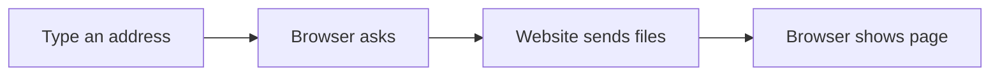

# 🌐 Internet & Digital Citizenship

*Grade 3 — Digital Explorer*

*How a webpage reaches your screen*

Topics covered this grade:

- **Browsers and search engines**
- **Basic searching**
- **Online safety**
- **Passwords**
- **Privacy**
- **Respectful online behavior**

---

### 💡 Browsers and search engines

**Concept:** A browser is the app you use to get on the internet, while a search engine is a special website inside the browser that helps you find specific information.

**Example:** Google Chrome and Apple Safari are browsers. Google Search and Microsoft Bing are search engines.

**Why it matters:** If you don't know the difference, you might get confused when a teacher tells you to 'open your browser' versus 'search for a topic'.

**Did you know?** Many people think Google is the entire internet! Actually, Google is just a search engine that helps you find things on the internet.

---

### ⚙️ Basic searching

*Learn how to find exactly what you need without getting lost.*

1. **Open your browser and click on the long search bar at the top or middle.** This is where you type what you are looking for.
2. **Type a few important key words instead of a long, full sentence.** Type 'fastest land animal' instead of 'what is the animal that runs the fastest on land?'
3. **Press 'Enter' and scan the list of results that appear.** Do not just click the very first link—sometimes the best answer is the second or third one.
4. **Look at the short description under the blue link before clicking.** This helps you guess if the website has the answer you need.
5. **Save or finish the activity.** Use the File menu or the activity button, then wait for confirmation that the work is complete.

💡 **Tip:** If you spell a word wrong, the search engine will often say 'Did you mean...?' and give you the correct spelling.

---

### 💡 Online safety

**Concept:** Online safety means protecting yourself, your computer, and your personal information when you are exploring the internet.

**Example:** Never share your real name, address, or school name with someone you meet in an online game.

**Why it matters:** Not everyone on the internet is a friend. Keeping your information secret keeps you safe in the real world.

**Did you know?** Even if an online character looks like a kid, it could be an adult pretending. Always stick to playing with friends you know in real life.

---

### 💡 Passwords

**Concept:** A password is a secret lock that keeps your online accounts and information completely private.

**Example:** A good password uses a mix of letters, numbers, and symbols, like 'BlueDog8!'. It should never just be 'password123'.

**Why it matters:** If someone guesses your password, they can log into your games, delete your work, or pretend to be you.

**Did you know?** You should never share your password with your best friend, even if you trust them. The only people who should know are you and your parents.

---

### 💡 Privacy

**Concept:** Privacy means deciding who gets to see your personal information and who doesn't. You have the right to keep things private online.

**Example:** Think of privacy like closing the curtains in your house so strangers can't see inside.

**Why it matters:** Once you put a picture or a secret on the internet, it is almost impossible to erase it completely.

**Did you know?** Even if an app promises that a picture will 'disappear in 10 seconds', someone can always take a screenshot and save it forever.

---

### 💡 Respectful online behavior

**Concept:** Being respectful online means treating others with the exact same kindness you would use in a classroom.

**Example:** Always use kind words when sending a message, playing a multiplayer game, or commenting on someone's work.

**Why it matters:** Words on a screen can hurt just as much as spoken words. Bullying online is just as bad as bullying in person.

**Did you know?** Some people think that because they are hiding behind a screen, rules don't apply. But being a good citizen applies everywhere, including the internet!

## Review

<FlashcardDeck cards={[{"front":"Browsers and search engines","back":"A browser is the app you use to get on the internet, while a search engine is a special website inside the browser that helps you find specific information."},{"front":"Online safety","back":"Online safety means protecting yourself, your computer, and your personal information when you are exploring the internet."},{"front":"Passwords","back":"A password is a secret lock that keeps your online accounts and information completely private."},{"front":"Privacy","back":"Privacy means deciding who gets to see your personal information and who doesn't."},{"front":"Respectful online behavior","back":"Being respectful online means treating others with the exact same kindness you would use in a classroom."}]} />
