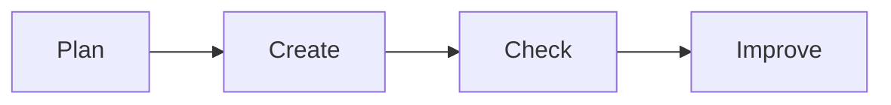

# 📊 Office Productivity

*Grade 3 — Digital Explorer*

*A simple digital work cycle*

Topics covered this grade:

- **Basic documents; formatting text**
- **Inserting images**
- **Simple tables**
- **Creating a short presentation with text and images**

---

### ⚙️ Basic documents; formatting text

*Make your stories and reports look beautiful and professional.*

1. **Type a short paragraph in Google Docs or Microsoft Word.** Don't worry about how it looks yet, just get the words on the page.
2. **Click and drag your mouse over a word to highlight it in blue.** This selects the word so you can change it.
3. **Look at the toolbar at the top and click the number to change the 'Font Size'.** Make titles big (like 24) and normal text smaller (like 12).
4. **Click the 'Text Color' button (usually an 'A' with a colored line) to change the color.** Pick a dark color that is easy to read against the white page.
5. **Select your title and click the 'Center Align' button (lines in the middle).** This pushes your title perfectly to the middle of the page.

💡 **Tip:** Do not use yellow text! It is almost impossible to read on a white background.

---

### ⚙️ Inserting images

*Add helpful pictures to make your document more interesting.*

1. **Click on the page exactly where you want your picture to go.** The blinking line shows where the picture will drop.
2. **Click the 'Insert' menu at the top and select 'Image' or 'Picture'.** A box will open asking where to find the picture.
3. **Choose 'Upload from computer' or 'Search the web'.** If you search the web, type what you are looking for and hit Enter.
4. **Click the picture you want and press the blue 'Insert' button.** The picture will appear in your document.
5. **Click the picture once, grab a blue corner square, and drag to resize it.** Always use the corners! Pulling the sides will squish the picture and make it look weird.

💡 **Tip:** If you want to move the picture around easily, look for a 'Wrap Text' option when you click the image.

---

### ⚙️ Simple tables

*Organize information into neat rows and columns.*

1. **Go to the 'Insert' menu and click 'Table'.** A grid of small squares will appear.
2. **Move your mouse over the grid to choose how many boxes you want.** For example, 3 boxes wide and 4 boxes down (3x4).
3. **Click the mouse, and the table will appear on your page.** It will look like a blank grid.
4. **Click inside the top left box (called a 'cell') and type a heading, like 'Monday'.** You can make the headings bold to stand out.
5. **Press the 'Tab' key on your keyboard to quickly jump to the next box.** This is much faster than using the mouse to click each box.

💡 **Tip:** Tables are perfect for making class schedules or organizing lists of facts!

---

### ⚙️ Creating a short presentation with text and images

*Build a slide deck to show off your project to the class.*

1. **Open Google Slides or PowerPoint and click 'Blank Presentation'.** You will start with a plain white title slide.
2. **Click the 'Theme' menu on the right side and pick a cool design.** This will instantly make all your slides look colorful and matching.
3. **Click the big text box and type the title of your project.** Click the smaller box underneath to type your name.
4. **Click the 'New Slide' button (usually a plus sign +) to add a second page.** Choose a layout that has space for text on one side and a picture on the other.
5. **Type three short bullet points about your topic, and insert a matching picture.** Keep your text short—you should explain the details out loud when you present!

💡 **Tip:** Press the 'Present' or 'Slideshow' button to see how it looks full screen.

