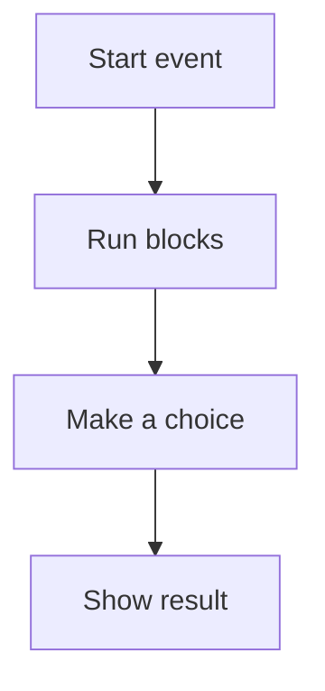

# 🐱 Scratch & Logic

*Grade 3 — Digital Explorer*

*How a Scratch program runs*

Topics covered this grade:

- **Sprites and backdrops**
- **Sequence**
- **Events**
- **Motion**
- **Dialogue**
- **Simple loops**
- **Interactive stories**

---

### 💡 Sprites and backdrops

**Concept:** Sprites are the characters or objects that move and act. Backdrops are the pictures on the stage that create the setting for your story.

**Example:** You could have a spaceship sprite flying around in a starry space backdrop.

**Why it matters:** Using the right backdrop helps tell the story. A spaceship sprite looks silly if the backdrop is a grocery store!

**Did you know?** Backdrops can't move around the screen like sprites can, but you can write code to switch from one backdrop to another to change the scene.

---

### 💡 Sequence

**Concept:** A sequence is the exact order that commands are carried out by the computer, one right after the other from top to bottom.

**Example:** If you want a sprite to walk over to a door and then say 'Open!', you must put the 'move' block before the 'say' block in the sequence.

**Why it matters:** Computers follow instructions exactly as they are written. If you put the 'say' block first, the sprite will talk to empty space before walking.

**Did you know?** People sequence things every day without realizing it. Putting on your socks before your shoes is a sequence!

---

### 💡 Events

**Concept:** Events are the triggers that tell a piece of code it is time to wake up and start running.

**Example:** The 'When Green Flag Clicked' block is an event. 'When Space Key Pressed' is another event.

**Why it matters:** Without an event block at the top, a stack of code will just sit there and never run. In Grade 3, connect this idea to a small project so you can see it working instead of only memorising a definition.

**Did you know?** You can have many different event blocks in the same game. One event can start the music, while a different event makes the character jump.

---

### ⚙️ Motion

*Make your sprite explore every corner of the stage.*

1. **Click the blue 'Motion' category to find all the movement blocks.** These blocks control exactly where your sprite goes.
2. **Drag a 'Point in direction' block and click the number to choose a direction.** You can use the little steering wheel to make your sprite point up, down, left, or right.
3. **Use a 'Glide 1 secs to x: y:' block to make your sprite move smoothly.** Unlike the 'move 10 steps' block, glide makes the sprite float gracefully across the screen.
4. **Experiment with the 'Go to random position' block.** This is great for making a game where you have to catch something that keeps moving around.
5. **Save or finish the activity.** Use the File menu or the activity button, then wait for confirmation that the work is complete.

💡 **Tip:** If your sprite gets stuck upside down after turning, click the 'Direction' box in the sprite info area and choose the 'Left/Right' arrow icon.

---

### ⚙️ Dialogue

*Make two characters have a conversation without talking over each other.*

1. **Select your first sprite and drag in a 'Say [Hello!] for 2 seconds' block.** A comic book speech bubble will appear next to the sprite.
2. **Select your second sprite and drag in a 'Wait 2 seconds' block first.** This is the most important step! The second sprite has to wait while the first one is talking.
3. **Add a 'Say [How are you?]' block right under the wait block.** Now the second sprite will answer after the first one is finished.
4. **Go back to the first sprite and add another 'Wait' block.** They have to take turns waiting and talking.
5. **Save or finish the activity.** Use the File menu or the activity button, then wait for confirmation that the work is complete.

💡 **Tip:** Read the conversation out loud to make sure the timing sounds natural.

---

### 💡 Simple loops

**Concept:** A loop is a special 'hug' block that tells the computer to repeat the instructions inside it many times.

**Example:** Instead of dragging in ten 'move' blocks, you can use one 'Repeat 10' loop with a single 'move' block inside it.

**Why it matters:** Loops save you time and make your code much shorter and easier to read. In Grade 3, connect this idea to a small project so you can see it working instead of only memorising a definition.

**Did you know?** The 'Forever' loop will literally run forever until you press the red stop sign to end the program!

---

### 💡 Interactive stories

**Concept:** An interactive story is a project where the person playing can press buttons or answer questions to change what happens in the story.

**Example:** You can program a wizard sprite to ask 'Do you want to open the red door or the blue door?' and send the player to a different backdrop depending on their answer.

**Why it matters:** Interactive stories turn the reader into a player, making the experience much more fun and engaging.

**Did you know?** You don't need a lot of complicated code to make a story interactive. Just using a few keys to change backdrops is a great start.

## Review

<FlashcardDeck cards={[{"front":"Sprites and backdrops","back":"Sprites are the characters or objects that move and act."},{"front":"Sequence","back":"A sequence is the exact order that commands are carried out by the computer, one right after the other from top to bottom."},{"front":"Events","back":"Events are the triggers that tell a piece of code it is time to wake up and start running."},{"front":"Simple loops","back":"A loop is a special 'hug' block that tells the computer to repeat the instructions inside it many times."},{"front":"Interactive stories","back":"An interactive story is a project where the person playing can press buttons or answer questions to change what happens in the story."}]} />
