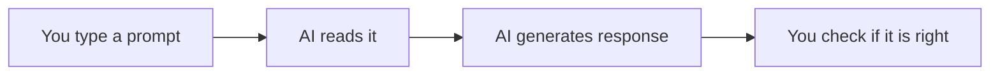

# 🤖 AI Foundations

*Grade 4 — Digital Creator*

*How an AI assistant answers a question*

Topics covered this grade:

- **What AI is; AI in everyday life**
- **Generative AI; AI assistants**
- **Basic prompting**
- **Brainstorming and learning with AI**
- **AI limitations; privacy and responsible use**

---

### 💡 What AI is; AI in everyday life

**Concept:** Artificial Intelligence (AI) is a branch of computer science where programmers build systems capable of doing things that usually require human intelligence, like understanding language or recognizing pictures.

**Example:** When a map app on your phone automatically finds the fastest route to school around a traffic jam, it is using AI.

**Why it matters:** AI is becoming a part of almost every job and tool in the world, so understanding how it works will give you a huge advantage in the future.

**Did you know?** Many movies show AI as robots that want to take over the world, but real AI is just a bunch of math and code running on servers to help us solve problems.

---

### 💡 Generative AI; AI assistants

**Concept:** Generative AI is a specific type of AI that can create brand new content—like writing text, drawing images, or even writing code—based on your instructions. AI assistants use this to help you with tasks.

**Example:** If you ask an AI assistant like ChatGPT to write a poem about a flying turtle, it uses generative AI to instantly invent a poem that has never existed before.

**Why it matters:** Instead of just searching for information that someone else already wrote (like a Google search), Generative AI lets you create custom tools and answers for your specific needs.

**Did you know?** AI assistants don't actually 'know' facts like a human does. They just predict which word should come next based on millions of books and websites they were trained on.

---

### ⚙️ Basic prompting

*Get the best possible answers from an AI by giving it clear instructions.*

1. **Start with a clear, direct instruction verb, like 'Write', 'Explain', or 'List'.** Don't just say 'Space' — say 'Explain how rockets fly to space'.
2. **Give the AI some context about who you are or what the answer is for.** Add '...for a 4th-grade science project' so the AI doesn't give you a college-level physics paper.
3. **Specify how long or what format you want the answer in.** Tell it to 'Give me 3 bullet points' instead of letting it write a long essay.
4. **Read the answer carefully and find what is missing or wrong.** The first answer is almost never perfect, and that is completely normal.
5. **Reply to the AI asking it to 'try again' with more specific instructions.** Say 'Make it funnier' or 'Include a fact about Mars' to improve the result.

💡 **Tip:** Treat the AI like a very smart robot that has no common sense—you have to explain exactly what you want.

---

### ⚙️ Brainstorming and learning with AI

*Use AI to overcome 'writer's block' and spark your own creativity.*

1. **Ask the AI to generate a list of ideas when you are stuck on a project.** Type 'Give me 5 unique ideas for a school project about plants'.
2. **Pick your favorite idea from the list, or combine two ideas together.** Never just copy the first idea. Use the AI's list to inspire your own choice.
3. **Ask the AI to explain a confusing concept you didn't understand in class.** Type 'Explain photosynthesis using a simple analogy like baking a cake'.
4. **Ask the AI to test your knowledge by giving you a short quiz.** Say 'Ask me 3 multiple-choice questions about the solar system'.
5. **Always write your final assignment in your own words, using the AI only as a tutor.** Copying and pasting an AI's writing and pretending it is yours is cheating.

💡 **Tip:** If you don't understand the AI's explanation, tell it 'I still don't get it, try explaining it differently'.

---

### 💡 AI limitations; privacy and responsible use

**Concept:** AI has severe limitations: it can confidently make up fake information (called 'hallucinating'), it doesn't understand right from wrong, and it records what you type into it.

**Example:** An AI might invent a fake historical battle that never happened, and sound completely certain that it did.

**Why it matters:** If you trust everything an AI says without checking, you will eventually look foolish or fail an assignment. If you share private info, it could be used by others.

**Did you know?** Many people think AI is private like a diary. Actually, engineers often read transcripts to improve the AI, so never share secrets or personal details!

## Review

<FlashcardDeck cards={[{"front":"What AI is; AI in everyday life","back":"Artificial Intelligence (AI) is a branch of computer science where programmers build systems capable of doing things that usually require human intelligence, like understanding language or recognizing pictures."},{"front":"Generative AI; AI assistants","back":"Generative AI is a specific type of AI that can create brand new content—like writing text, drawing images, or even writing code—based on your instructions."},{"front":"AI limitations; privacy and responsible use","back":"AI has severe limitations: it can confidently make up fake information (called 'hallucinating'), it doesn't understand right from wrong, and it records what you type into it."}]} />
