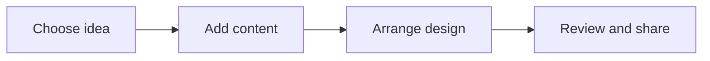

# 🎨 Canva & Digital Creativity

*Grade 4 — Digital Creator*

*How a design comes together*

Topics covered this grade:

- **Design basics; typography; colors; layout**
- **Posters**
- **Presentations**
- **Infographics**
- **Visual storytelling**

---

### 💡 Design basics; typography; colors; layout

**Concept:** Good design uses clear fonts (typography), matching colors, and a balanced layout to share a message so people can understand it quickly and easily.

**Example:** If you are making a poster about a calm day at the beach, you would use soft blue colors and a smooth, rounded font, not bright red colors with sharp, scary letters.

**Why it matters:** If your design is too cluttered or the colors clash, people will ignore your poster instead of reading your important message.

**Did you know?** Using 10 different fonts and every color of the rainbow doesn't make a design look better—it usually makes it unreadable! Two fonts are almost always enough.

---

### ⚙️ Posters

*Design a beautiful poster that grabs attention from across the room.*

1. **Choose a 'Poster' template that matches the mood of your topic.** A science fair poster should look clean and futuristic, while a bake sale poster can look warm and playful.
2. **Add a large, catchy headline at the very top using a bold, easy-to-read font.** This should be the largest text on the page so it is the first thing people see.
3. **Include the 'Who, What, Where, and When' in smaller text below the headline.** Make sure this information is highly visible and not hidden by a busy background image.
4. **Add one large, high-quality central image instead of five tiny ones.** A single strong image is much more powerful and keeps the poster from looking messy.
5. **Leave plenty of empty space (called 'white space') around your text.** White space acts like a frame and gives the reader's eyes a place to rest.

💡 **Tip:** Zoom out on your screen until the poster is small—if you can still read the headline, you did a great job!

---

### ⚙️ Presentations

*Make digital slides that support your speech without putting people to sleep.*

1. **Start with a presentation template to keep your colors and fonts consistent.** Consistency makes your presentation look professional from the first slide to the last.
2. **Change the background color slightly on title slides to make them stand out.** This acts as a visual signal to the audience that you are moving to a new topic.
3. **Use the 'Animate' button to make your text appear one bullet point at a time.** This keeps the audience focused on what you are saying right now, rather than reading ahead.
4. **Replace text with icons or small pictures wherever possible.** If you are talking about three rules, use a picture for each rule instead of writing a paragraph.
5. **Include a final slide with a summary or a 'Any Questions?' prompt.** This gives your presentation a strong, clear ending instead of just stopping abruptly.

💡 **Tip:** Never put more than six lines of text on a single presentation slide.

---

### 💡 Infographics

**Concept:** An infographic is a visual poster that uses pictures, icons, and short bits of text to explain a complicated topic or show data in a very simple way.

**Example:** Instead of writing a long essay about how much water a plant needs, you could create an infographic showing three water drops next to a picture of a healthy plant.

**Why it matters:** Human brains process pictures much faster than words, so infographics are the best way to explain facts quickly.

**Did you know?** You don't have to be good at drawing to make an infographic! Canva has thousands of pre-drawn icons you can just drag and drop.

---

### ⚙️ Visual storytelling

*Tell a complete story using pictures and very few words.*

1. **Create a series of panels or slides like a digital comic book.** Each slide should represent one main event in your story (Beginning, Middle, End).
2. **Find characters in the 'Elements' tab and use the same ones on every slide.** This helps the reader understand that it is the same person going through the story.
3. **Search for 'Speech Bubbles' and drag them near your characters' mouths.** Type short, punchy dialogue inside the bubbles so the characters can talk to each other.
4. **Change the background color of a slide to match the mood.** Use dark blue for a scary or sad moment, and bright yellow for a happy resolution.
5. **Add action lines or stickers (like 'Pow!' or 'Zoom!') to show movement.** These small details bring static pictures to life and make the story exciting.

💡 **Tip:** Make sure the text in your speech bubbles is large enough to read easily.

## Review

<FlashcardDeck cards={[{"front":"Design basics; typography; colors; layout","back":"Good design uses clear fonts (typography), matching colors, and a balanced layout to share a message so people can understand it quickly and easily."},{"front":"Infographics","back":"An infographic is a visual poster that uses pictures, icons, and short bits of text to explain a complicated topic or show data in a very simple way."}]} />
