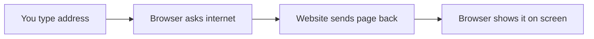

# 🌐 Internet & Digital Citizenship

*Grade 4 — Digital Creator*

*What happens when you visit a website*

Topics covered this grade:

- **Browsers; effective searching**
- **Evaluating basic information**
- **Passwords; privacy**
- **Phishing/scams**
- **Digital footprint and responsible behavior**

---

### ⚙️ Browsers; effective searching

*Find exactly what you are looking for quickly.*

1. **Type specific keywords instead of full sentences into the search bar.** For example, search for 'fastest land animal speed' instead of 'what is the animal that runs the fastest on land'.
2. **Use quotation marks around words to find an exact phrase.** Searching for "Abraham Lincoln" will only show pages with his full name together, not just 'Lincoln'.
3. **Hold the 'Ctrl' (or 'Cmd') key while clicking a search result to open it in a new tab.** This keeps your original search results open so you can easily go back and try another link.
4. **Look closely at the website address before you click to make sure it looks trustworthy.** Addresses ending in .edu or .gov are usually more reliable for school projects than .com sites.
5. **Press 'Ctrl + H' to open your History if you need to find a site you visited yesterday.** The browser saves a list of everywhere you have been, which is helpful if you forgot to save a bookmark.

💡 **Tip:** If you don't find what you need on the first try, change your keywords and search again.

---

### 💡 Evaluating basic information

**Concept:** Evaluating information means acting like a detective to check if a website is reliable, honest, and written by someone who actually knows the facts.

**Example:** If you are researching dinosaurs and the website says a T-Rex ate pizza, you need to check who wrote the page and compare it to a trusted science book.

**Why it matters:** Anyone can put anything on the internet, so you must protect yourself from learning and repeating fake information.

**Did you know?** Many people believe that if a website looks beautiful and professional, it must be true. But even bad information can have great graphic design!

---

### ⚙️ Passwords; privacy

*Keep your accounts safe from hackers and strangers.*

1. **Create a 'passphrase' using three or four random words.** A password like 'PurpleElephantGuitar9!' is very strong and much easier to remember than 'Xj7#pR2'.
2. **Never use your name, birthday, or pet's name in your password.** These are the very first things a hacker will guess if they are trying to break into your account.
3. **Write your password down in a physical notebook kept safely at home, not on a sticky note on your computer.** Digital files can be stolen, but a notebook in your drawer is safe.
4. **Check the privacy settings on any game or app you use with a parent.** Make sure your profile is set to 'Private' so only approved friends can see what you post.
5. **Never share your password with anyone, not even your best friend.** The only people who should ever know your passwords are you and your parents.

💡 **Tip:** Use a different password for your most important accounts, like your school email.

---

### 💡 Phishing/scams

**Concept:** Phishing is a sneaky trick where scammers send fake emails or messages that look like they are from a real company, trying to steal your password or personal information.

**Example:** You might get an email that looks exactly like it is from Roblox saying 'Your account will be deleted! Click here to log in and save it', but the link actually goes to a scammer.

**Why it matters:** Falling for a phishing scam can result in losing your game accounts, your files, or even your parents' money.

**Did you know?** It's called 'phishing' because the scammers are 'fishing' for victims by throwing out a fake 'bait' message to see who will bite!

---

### 💡 Digital footprint and responsible behavior

**Concept:** Your digital footprint is the permanent trail of everything you do online, including photos you post, comments you write, and games you play.

**Example:** If you post an angry comment on a YouTube video, that comment becomes part of your digital footprint and might stay there forever.

**Why it matters:** When you apply for a job or college in the future, people might search your name to see what kind of digital footprint you have left behind.

**Did you know?** A common mistake is thinking that deleting a photo removes it completely. Someone could have taken a screenshot before you deleted it, meaning it still exists.

## Review

<FlashcardDeck cards={[{"front":"Evaluating basic information","back":"Evaluating information means acting like a detective to check if a website is reliable, honest, and written by someone who actually knows the facts."},{"front":"Phishing/scams","back":"Phishing is a sneaky trick where scammers send fake emails or messages that look like they are from a real company, trying to steal your password or personal information."},{"front":"Digital footprint and responsible behavior","back":"Your digital footprint is the permanent trail of everything you do online, including photos you post, comments you write, and games you play."}]} />
