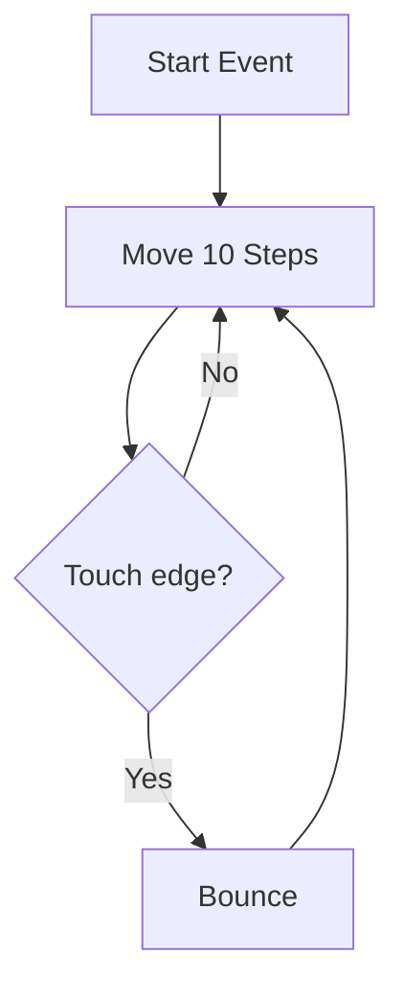

# 🐱 Scratch & Computational Thinking

*Grade 4 — Digital Creator*

*A simple loop algorithm in Scratch*

Topics covered this grade:

- **Algorithms; sequence; events**
- **Loops; conditions**
- **Variables introduction**
- **Debugging**
- **Interactive stories and simple games**

---

### 💡 Algorithms; sequence; events

**Concept:** An algorithm is a step-by-step plan to solve a problem. In Scratch, this plan is made of a sequence of code blocks that only start running when a specific event happens.

**Example:** When you press the spacebar (the event), the sprite moves forward, waits 1 second, and says 'Hello!' (the sequence). This whole plan is an algorithm.

**Why it matters:** Computers aren't smart enough to guess what you want; you have to give them the exact algorithm in the correct sequence to get the right result.

**Did you know?** The word 'algorithm' sounds complicated, but a recipe for baking a cake or instructions for building a Lego set are both everyday algorithms!

---

### 💡 Loops; conditions

**Concept:** Loops are special blocks that tell the computer to repeat a set of instructions, while conditions (if-then statements) let the program make decisions based on what is happening.

**Example:** You can use a 'Forever' loop to make a star spin continuously, and an 'If touching color red' condition to make it stop spinning when it hits a wall.

**Why it matters:** Without loops, you would have to drag in 100 'move' blocks just to make a character walk across the screen. Loops save time and make code much cleaner.

**Did you know?** A common mistake is putting code outside a 'forever' loop by accident and wondering why it only happens once. Always check what is hugged inside the loop!

---

### 💡 Variables introduction

**Concept:** A variable is like a labeled container or a box that stores a piece of information that can change while the program is running.

**Example:** In a racing game, you can create a variable called 'Score' that starts at 0 and goes up by 1 every time your car collects a coin.

**Why it matters:** Variables allow games to be interactive. Without them, you couldn't have health bars, timers, player names, or high scores.

**Did you know?** You can name a variable anything you want, like 'FluffyBunnies', but it's much better to name it what it actually holds, like 'Timer', so you don't get confused later.

---

### ⚙️ Debugging

*Find and fix mistakes when your code doesn't do what you expect.*

1. **Play your game and watch carefully to see exactly when the problem happens.** Does the sprite jump too high? Does it go the wrong way? Identifying the exact error is the first step.
2. **Read through your code blocks from top to bottom, just like reading a book.** Check if the blocks are in the wrong order or if a number was typed incorrectly.
3. **Disconnect a large chunk of code and test just one small part at a time.** This helps you narrow down which specific block is causing the trouble.
4. **Add a 'Say' block temporarily to check if a variable is working.** Make the sprite say the 'Score' variable out loud to see if it is actually going up.
5. **Ask a classmate to look at your screen and explain what you want the code to do.** Sometimes just explaining the problem out loud helps you realize the mistake immediately (this is called 'Rubber Duck Debugging'!).

💡 **Tip:** Everyone makes mistakes while coding, even professional programmers. Don't get frustrated; treat it like solving a puzzle.

---

### ⚙️ Interactive stories and simple games

*Combine all your Scratch skills to build a complete project.*

1. **Plan your project on paper first, sketching out the background and characters.** Decide what the goal of the game is before you start dragging in code blocks.
2. **Use 'Broadcast' blocks to send invisible messages between sprites.** For example, when the hero touches the door, it broadcasts 'Next Level' to change the backdrop.
3. **Add 'If-Then' blocks inside a 'Forever' loop to control your character with the keyboard arrows.** This makes the character constantly check if you are pressing a key.
4. **Click the 'Sounds' tab and add music or sound effects to actions.** A 'pop' sound when collecting an item makes the game feel much more professional and fun.
5. **Create a 'Game Over' or 'You Win!' screen that hides all other sprites when the game ends.** This gives the player a clear signal that they have finished playing.

💡 **Tip:** Start simple! Get one character moving perfectly before trying to add ten enemies.

## Review

<FlashcardDeck cards={[{"front":"Algorithms; sequence; events","back":"An algorithm is a step-by-step plan to solve a problem."},{"front":"Loops; conditions","back":"Loops are special blocks that tell the computer to repeat a set of instructions, while conditions (if-then statements) let the program make decisions based on what is happening."},{"front":"Variables introduction","back":"A variable is like a labeled container or a box that stores a piece of information that can change while the program is running."}]} />
