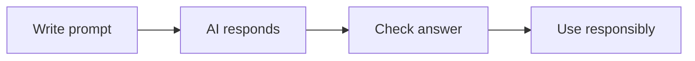

# 🤖 AI & Productivity Tools

*Grade 5 — Digital Problem Solver*

*A careful AI workflow*

Topics covered this grade:

- **AI fundamentals; prompting basics**
- **Context and clear instructions**
- **Brainstorming; summarizing; learning support**
- **AI-assisted creative work**
- **Verification and responsible use**
- **Core tools: an AI assistant, Canva AI and one research/learning AI tool**

---

### 💡 AI fundamentals; prompting basics

**Concept:** Building on the basics, good prompting involves being specific and giving the AI a clear role.

**Example:** Instead of 'Write a story,' try 'Act as a history teacher and tell a story about life in ancient Rome.'

**Why it matters:** Learning about ai fundamentals; prompting basics helps you make better choices when you create, communicate, and solve problems with technology.

**Did you know?** A common mix-up is thinking that technology always makes the right choice. People still need to check the result and use good judgement.

---

### ⚙️ Context and clear instructions

*Follow these steps to practise context and clear instructions from start to finish.*

1. **State the goal clearly (e.g., 'I need a summary of this article').** Look for the named button, menu, or result on the screen before continuing.
2. **Specify the length (e.g., 'in exactly 100 words').** Look for the named button, menu, or result on the screen before continuing.
3. **Give the AI an intended audience (e.g., 'for a 5th grade student').** Look for the named button, menu, or result on the screen before continuing.
4. **Check your work and correct any mistake.** Compare the result with the task and use Undo or Backspace if something is not right.
5. **Save or finish the activity.** Use the File menu or the activity button, then wait for confirmation that the work is complete.

💡 **Tip:** Work slowly, read each instruction, and ask a teacher before changing a setting you do not recognise.

---

### ⚙️ Brainstorming; summarizing; learning support

*Follow these steps to practise brainstorming; summarizing; learning support from start to finish.*

1. **Ask the AI to 'Brainstorm 10 title ideas for my project on ocean pollution.'** Look for the named button, menu, or result on the screen before continuing.
2. **Paste a long text and ask for 'the 3 most important points.'** Look for the named button, menu, or result on the screen before continuing.
3. **Ask 'Give me a quiz with 5 questions based on this paragraph' to test your learning.** Look for the named button, menu, or result on the screen before continuing.
4. **Check your work and correct any mistake.** Compare the result with the task and use Undo or Backspace if something is not right.
5. **Save or finish the activity.** Use the File menu or the activity button, then wait for confirmation that the work is complete.

💡 **Tip:** Work slowly, read each instruction, and ask a teacher before changing a setting you do not recognise.

---

### 💡 AI-assisted creative work

**Concept:** AI can be used as a 'co-creator' to help you generate ideas for images, music, or writing.

**Example:** Use an AI image generator to create a background for your Scratch game based on your description.

**Why it matters:** Learning about ai-assisted creative work helps you make better choices when you create, communicate, and solve problems with technology. In Grade 5, connect this idea to a small project so you can see it working instead of only memorising a definition.

**Did you know?** A common mix-up is thinking that technology always makes the right choice. People still need to check the result and use good judgement.

---

### ⚙️ Verification and responsible use

*Follow these steps to practise verification and responsible use from start to finish.*

1. **Always check any dates, names, or facts an AI gives you using a second source.** Look for the named button, menu, or result on the screen before continuing.
2. **If the AI's output sounds strange or bias, ask it to 'cite its sources.'** Look for the named button, menu, or result on the screen before continuing.
3. **Be honest about when you have used AI to help you with your work.** Look for the named button, menu, or result on the screen before continuing.
4. **Check your work and correct any mistake.** Compare the result with the task and use Undo or Backspace if something is not right.
5. **Save or finish the activity.** Use the File menu or the activity button, then wait for confirmation that the work is complete.

💡 **Tip:** Work slowly, read each instruction, and ask a teacher before changing a setting you do not recognise.

---

### 💡 Core tools: an AI assistant, Canva AI and one research/learning AI tool

**Concept:** Becoming familiar with a few key AI tools allows you to choose the best one for the task at hand.

**Example:** Use Gemini for writing, Magic Media in Canva for pictures, and Perplexity for searching.

**Why it matters:** Learning about core tools: an ai assistant, canva ai and one research/learning ai tool helps you make better choices when you create, communicate, and solve problems with technology.

**Did you know?** A common mix-up is thinking that technology always makes the right choice. People still need to check the result and use good judgement.

## Review

<FlashcardDeck cards={[{"front":"AI fundamentals; prompting basics","back":"Building on the basics, good prompting involves being specific and giving the AI a clear role."},{"front":"AI-assisted creative work","back":"AI can be used as a 'co-creator' to help you generate ideas for images, music, or writing."},{"front":"Core tools: an AI assistant, Canva AI and one research/learning AI tool","back":"Becoming familiar with a few key AI tools allows you to choose the best one for the task at hand."}]} />
