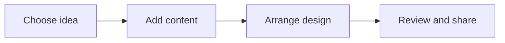

# 🎨 Canva & Digital Creativity

*Grade 5 — Digital Problem Solver*

*How a design comes together*

Topics covered this grade:

- **Typography; color and layout**
- **Infographics**
- **Campaign posters**
- **Presentation design**
- **Visual communication**

---

### 💡 Typography; color and layout

**Concept:** Advanced design involves choosing fonts and colors that match the mood of your project and arranging elements to guide the viewer's eye.

**Example:** Use 'Serif' fonts (with small feet) for a formal look, and 'Sans Serif' for a modern, clean look.

**Why it matters:** Learning about typography; color and layout helps you make better choices when you create, communicate, and solve problems with technology.

**Did you know?** A common mix-up is thinking that technology always makes the right choice. People still need to check the result and use good judgement.

---

### ⚙️ Infographics

*Follow these steps to practise infographics from start to finish.*

1. **Pick a specific topic (e.g., 'How to Save Water') and find 3-4 key facts.** Look for the named button, menu, or result on the screen before continuing.
2. **Use icons and charts to represent your data visually.** Look for the named button, menu, or result on the screen before continuing.
3. **Keep the text short and use a clear path for the reader to follow from top to bottom.** Look for the named button, menu, or result on the screen before continuing.
4. **Check your work and correct any mistake.** Compare the result with the task and use Undo or Backspace if something is not right.
5. **Save or finish the activity.** Use the File menu or the activity button, then wait for confirmation that the work is complete.

💡 **Tip:** Work slowly, read each instruction, and ask a teacher before changing a setting you do not recognise.

---

### 💡 Campaign posters

**Concept:** A campaign poster is designed to persuade people to take action or support a cause.

**Example:** Create a poster for a 'Clean Up the School' campaign with a powerful slogan and an inspiring image.

**Why it matters:** Learning about campaign posters helps you make better choices when you create, communicate, and solve problems with technology. In Grade 5, connect this idea to a small project so you can see it working instead of only memorising a definition.

**Did you know?** A common mix-up is thinking that technology always makes the right choice. People still need to check the result and use good judgement.

---

### ⚙️ Presentation design

*Follow these steps to practise presentation design from start to finish.*

1. **Use high-quality images that aren't blurry or pixelated.** Look for the named button, menu, or result on the screen before continuing.
2. **Limit the amount of text on each slide to 5-6 bullet points maximum.** Look for the named button, menu, or result on the screen before continuing.
3. **Use 'Brand Kits' in Canva to keep your colors and fonts consistent.** Look for the named button, menu, or result on the screen before continuing.
4. **Check your work and correct any mistake.** Compare the result with the task and use Undo or Backspace if something is not right.
5. **Save or finish the activity.** Use the File menu or the activity button, then wait for confirmation that the work is complete.

💡 **Tip:** Work slowly, read each instruction, and ask a teacher before changing a setting you do not recognise.

---

### 💡 Visual communication

**Concept:** Visual communication is the use of graphic elements to convey information or ideas quickly and effectively.

**Example:** A red octagon is a visual way to communicate 'Stop' without using any words.

**Why it matters:** Learning about visual communication helps you make better choices when you create, communicate, and solve problems with technology. In Grade 5, connect this idea to a small project so you can see it working instead of only memorising a definition.

**Did you know?** A common mix-up is thinking that technology always makes the right choice. People still need to check the result and use good judgement.

## Review

<FlashcardDeck cards={[{"front":"Typography; color and layout","back":"Advanced design involves choosing fonts and colors that match the mood of your project and arranging elements to guide the viewer's eye."},{"front":"Campaign posters","back":"A campaign poster is designed to persuade people to take action or support a cause."},{"front":"Visual communication","back":"Visual communication is the use of graphic elements to convey information or ideas quickly and effectively."}]} />
