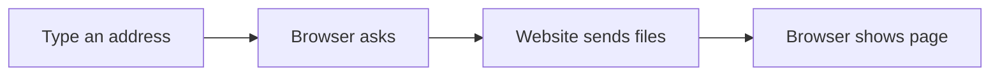

# 🌐 Internet & Digital Citizenship

*Grade 5 — Digital Problem Solver*

*How a webpage reaches your screen*

Topics covered this grade:

- **Effective research**
- **Reliable vs. unreliable information**
- **Privacy; scams**
- **Digital footprint**
- **Responsible communication**

---

### ⚙️ Effective research

*Gather information from the internet like a professional researcher.*

1. **Use a variety of different sources for your project.** Don't just use Wikipedia. Look at digital encyclopedias, news sites, and educational videos to get a complete picture.
2. **Read a paragraph, look away, and take notes in your own words.** Copying and pasting directly from a website without giving credit is called plagiarism, and it is a serious rule violation.
3. **Keep a running list of every website you use in a blank document.** You will need this list at the end of your project to create a 'Bibliography' or 'Works Cited' page.
4. **Use the 'Find' shortcut (Ctrl + F) on long web pages.** This helps you jump straight to the exact keyword you need without reading the whole article.
5. **Save or finish the activity.** Use the File menu or the activity button, then wait for confirmation that the work is complete.

💡 **Tip:** When searching, try adding 'site:.gov' or 'site:.edu' to your search to only see results from government or university websites.

---

### 💡 Reliable vs. unreliable information

**Concept:** Reliable information is written by experts, checked for accuracy, and backed by facts. Unreliable information may be biased, outdated, or completely made up.

**Example:** A report on climate change from a government science agency is highly reliable. A blog post by a random person selling vitamins is unreliable.

**Why it matters:** Basing your school project on unreliable information will result in a bad grade and spread false facts.

**Did you know?** A website is not reliable just because it is the first result on Google! Google ranks sites by popularity and keywords, not always by truth.

---

### ⚙️ Privacy; scams

*Protect your personal information from bad actors on the internet.*

1. **Be extremely careful with 'Clickbait' headlines.** Headlines that scream 'You won't believe this trick!' or 'Click here for free V-bucks' are usually designed to steal your data or show you ads.
2. **Turn on 'Two-Factor Authentication' (2FA) for your most important accounts.** This means even if a hacker guesses your password, they can't get in without the secret code sent to a phone.
3. **Never enter your password on a website that doesn't have the closed 'padlock' icon in the address bar.** The padlock means your connection is scrambled and safe from people trying to spy on it.
4. **If you receive an urgent email saying your account is blocked, do not click the link.** Go directly to the real website in a new tab and check your account there. This is a common trick called 'phishing'.
5. **Save or finish the activity.** Use the File menu or the activity button, then wait for confirmation that the work is complete.

💡 **Tip:** If something online sounds too good to be true, it is almost certainly a scam.

---

### 💡 Digital footprint

**Concept:** Your digital footprint is the permanent trail of data left by your online activities, including comments, photos, and game scores.

**Example:** A mean comment you leave on a YouTube video becomes part of your digital footprint, and it can stay there for years.

**Why it matters:** Colleges and future employers will search your name online. A positive digital footprint can help you, while a negative one can hurt your chances.

**Did you know?** Even if your account is private, screenshots exist! You should always assume that anything you post could eventually be seen by everyone.

---

### 💡 Responsible communication

**Concept:** Responsible communication means being polite, clear, and thoughtful when sending emails, texts, or participating in online groups.

**Example:** Typing an email to your teacher with a proper greeting ('Dear Mr. Smith') and complete sentences is responsible communication.

**Why it matters:** Without tone of voice or facial expressions, it is very easy for online messages to be misunderstood as rude or angry. In Grade 5, connect this idea to a small project so you can see it working instead of only memorising a definition.

**Did you know?** Avoid typing in 'ALL CAPS' because in digital communication, that looks exactly like YOU ARE SCREAMING at the other person.

## Review

<FlashcardDeck cards={[{"front":"Reliable vs. unreliable information","back":"Reliable information is written by experts, checked for accuracy, and backed by facts."},{"front":"Digital footprint","back":"Your digital footprint is the permanent trail of data left by your online activities, including comments, photos, and game scores."},{"front":"Responsible communication","back":"Responsible communication means being polite, clear, and thoughtful when sending emails, texts, or participating in online groups."}]} />
