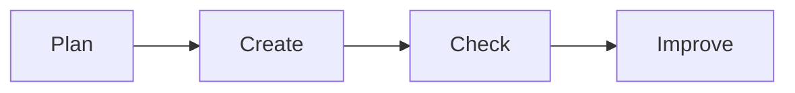

# 📊 Office Productivity

*Grade 5 — Digital Problem Solver*

*A simple digital work cycle*

Topics covered this grade:

- **Practical use of documents, presentations and spreadsheets**
- **Tables; formatting**
- **Basic formulas; charts**
- **Using the right tool for a task**

---

### 💡 Practical use of documents, presentations and spreadsheets

**Concept:** Mastering office tools means knowing not just how to use them, but knowing exactly which tool is right for the specific job you have to do.

**Example:** Use Word or Docs for writing a long history report, use PowerPoint or Slides for a visual class talk, and use Excel or Sheets to track data for a science experiment.

**Why it matters:** Using the wrong tool (like trying to write a 5-page essay in PowerPoint) will make your work look unprofessional and take twice as long.

**Did you know?** Spreadsheets aren't just for accountants doing math! They are fantastic tools for making checklists, tracking habits, and organizing large amounts of information.

---

### ⚙️ Tables; formatting

*Make complex data look neat and easy to read.*

1. **Insert a table and use 'Cell Merging' to create a main title.** Highlight the top row of cells, right-click, and select 'Merge Cells' to turn them into one giant box for your title.
2. **Apply 'Conditional Formatting' in a spreadsheet to color-code numbers.** Set a rule that makes the cell turn red if the number is low, and green if it is high.
3. **Use consistent fonts and colors throughout your tables.** Don't use five different fonts in one table. Keep it clean and professional.
4. **Adjust the column widths so the text doesn't look squished.** Hover your mouse between the column letters at the top and double-click to automatically fit the text perfectly.
5. **Save or finish the activity.** Use the File menu or the activity button, then wait for confirmation that the work is complete.

💡 **Tip:** Shading every other row with a light gray color (called 'banding') makes wide tables much easier for the eye to follow.

---

### ⚙️ Basic formulas; charts

*Let the computer do the heavy math lifting for you.*

1. **Type '=AVERAGE(' and select a list of numbers to find the middle value.** This is perfect for figuring out your average grade on a set of quizzes.
2. **Use '=MIN()' and '=MAX()' to find the smallest and largest values in your data.** This helps you quickly find the lowest temperature in a weather chart.
3. **Highlight all your data and labels, click 'Insert', and choose 'Pie Chart'.** A pie chart is the best way to show how different parts make up a whole, like showing how you spend your time every day.
4. **Add a clear Title and Data Labels to your chart.** A chart is useless if the person looking at it doesn't know what the colors mean.
5. **Save or finish the activity.** Use the File menu or the activity button, then wait for confirmation that the work is complete.

💡 **Tip:** Always remember that every formula in a spreadsheet must start with an equals sign (=)!

---

### 💡 Using the right tool for a task

**Concept:** Choosing the best application based on the format of your final project: text-heavy, data-heavy, or visual-heavy.

**Example:** If you want to write a letter to the mayor, Word is the tool. If you want to list the costs of a school trip, Excel is the tool.

**Why it matters:** Professionals in the real world expect information to be delivered in the correct format.

**Did you know?** You can actually put a small Excel table inside a Word document, combining the power of both tools!

## Review

<FlashcardDeck cards={[{"front":"Practical use of documents, presentations and spreadsheets","back":"Mastering office tools means knowing not just how to use them, but knowing exactly which tool is right for the specific job you have to do."},{"front":"Using the right tool for a task","back":"Choosing the best application based on the format of your final project: text-heavy, data-heavy, or visual-heavy."}]} />
