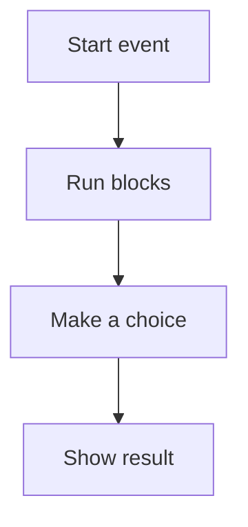

# 🐱 Scratch & Computational Thinking

*Grade 5 — Digital Problem Solver*

*How a Scratch program runs*

Topics covered this grade:

- **Algorithms; conditions; loops**
- **Variables; operators**
- **Scoring; game mechanics**
- **Debugging**

---

### 💡 Algorithms; conditions; loops

**Concept:** Using algorithms with nested loops (loops inside loops) and complex conditions allows for more advanced logic.

**Example:** A loop that checks 'If touching player' every second is a common game mechanic.

**Why it matters:** Learning about algorithms; conditions; loops helps you make better choices when you create, communicate, and solve problems with technology. In Grade 5, connect this idea to a small project so you can see it working instead of only memorising a definition.

**Did you know?** A common mix-up is thinking that technology always makes the right choice. People still need to check the result and use good judgement.

---

### 💡 Variables; operators

**Concept:** Operators let you perform math or compare values, which is essential for working with variables in games.

**Example:** Use the 'greater than' operator to check if 'Score > 10' to trigger a win.

**Why it matters:** Learning about variables; operators helps you make better choices when you create, communicate, and solve problems with technology. In Grade 5, connect this idea to a small project so you can see it working instead of only memorising a definition.

**Did you know?** A common mix-up is thinking that technology always makes the right choice. People still need to check the result and use good judgement.

---

### ⚙️ Scoring; game mechanics

*Follow these steps to practise scoring; game mechanics from start to finish.*

1. **Create a variable for 'Lives' and set it to 3 at the start of the game.** Look for the named button, menu, or result on the screen before continuing.
2. **Subtract 1 from 'Lives' whenever the sprite touches an enemy.** Look for the named button, menu, or result on the screen before continuing.
3. **Show a 'Game Over' message when 'Lives = 0.'** Look for the named button, menu, or result on the screen before continuing.
4. **Check your work and correct any mistake.** Compare the result with the task and use Undo or Backspace if something is not right.
5. **Save or finish the activity.** Use the File menu or the activity button, then wait for confirmation that the work is complete.

💡 **Tip:** Work slowly, read each instruction, and ask a teacher before changing a setting you do not recognise.

---

### ⚙️ Debugging

*Follow these steps to practise debugging from start to finish.*

1. **Use the 'Say' block to have your sprite tell you the value of a variable during the game.** Look for the named button, menu, or result on the screen before continuing.
2. **Slow down your code by adding 'Wait' blocks to see exactly what is happening step-by-step.** Look for the named button, menu, or result on the screen before continuing.
3. **Look for common mistakes, like forgetting to reset a variable at the start of the game.** Look for the named button, menu, or result on the screen before continuing.
4. **Check your work and correct any mistake.** Compare the result with the task and use Undo or Backspace if something is not right.
5. **Save or finish the activity.** Use the File menu or the activity button, then wait for confirmation that the work is complete.

💡 **Tip:** Work slowly, read each instruction, and ask a teacher before changing a setting you do not recognise.

## Review

<FlashcardDeck cards={[{"front":"Algorithms; conditions; loops","back":"Using algorithms with nested loops (loops inside loops) and complex conditions allows for more advanced logic."},{"front":"Variables; operators","back":"Operators let you perform math or compare values, which is essential for working with variables in games."}]} />
