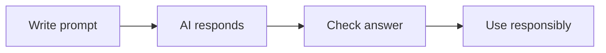

# 🤖 AI & Productivity Tools

*Grade 6 — Digital Builder*

*A careful AI workflow*

Topics covered this grade:

- **AI concepts; stronger prompting**
- **Context, constraints and desired output**
- **Research support; summarization**
- **Creative generation; fact-checking**
- **Limitations; privacy and copyright**
- **AI-assisted coding introduction**
- **Core tools: an AI assistant, Canva AI and one research/learning AI tool**

---

### 💡 AI concepts; stronger prompting

**Concept:** Professional prompting involves providing the AI with clear constraints, a specific format, and examples of what you want.

**Example:** Try 'Write a 3-paragraph summary of this text in bullet points, using a formal tone, and highlighting 3 key facts.'

**Why it matters:** Learning about ai concepts; stronger prompting helps you make better choices when you create, communicate, and solve problems with technology.

**Did you know?** A common mix-up is thinking that technology always makes the right choice. People still need to check the result and use good judgement.

---

### ⚙️ Context, constraints and desired output

*Follow these steps to practise context, constraints and desired output from start to finish.*

1. **Context: 'I am writing a report on renewable energy.'** Look for the named button, menu, or result on the screen before continuing.
2. **Constraint: 'Do not use any jargon; keep it under 200 words.'** Look for the named button, menu, or result on the screen before continuing.
3. **Output: 'Format the answer as a table with two columns: Advantage and Disadvantage.'** Look for the named button, menu, or result on the screen before continuing.
4. **Check your work and correct any mistake.** Compare the result with the task and use Undo or Backspace if something is not right.
5. **Save or finish the activity.** Use the File menu or the activity button, then wait for confirmation that the work is complete.

💡 **Tip:** Work slowly, read each instruction, and ask a teacher before changing a setting you do not recognise.

---

### ⚙️ Research support; summarization

*Follow these steps to practise research support; summarization from start to finish.*

1. **Use an AI to 'Explain this complex scientific paper in 5 simple bullet points.'** Look for the named button, menu, or result on the screen before continuing.
2. **Ask the AI to 'Find three opposing viewpoints on this topic' to ensure a balanced report.** Look for the named button, menu, or result on the screen before continuing.
3. **Use AI to generate a list of 'Frequently Asked Questions' for your project.** Look for the named button, menu, or result on the screen before continuing.
4. **Check your work and correct any mistake.** Compare the result with the task and use Undo or Backspace if something is not right.
5. **Save or finish the activity.** Use the File menu or the activity button, then wait for confirmation that the work is complete.

💡 **Tip:** Work slowly, read each instruction, and ask a teacher before changing a setting you do not recognise.

---

### ⚙️ Creative generation; fact-checking

*Follow these steps to practise creative generation; fact-checking from start to finish.*

1. **Generate a creative story prompt, then use AI to help you outline the plot.** Look for the named button, menu, or result on the screen before continuing.
2. **Paste a specific claim into an AI and ask 'Is this factually correct based on reliable sources?'** Look for the named button, menu, or result on the screen before continuing.
3. **Use AI to generate different color palettes or logo ideas for your Canva project.** Look for the named button, menu, or result on the screen before continuing.
4. **Check your work and correct any mistake.** Compare the result with the task and use Undo or Backspace if something is not right.
5. **Save or finish the activity.** Use the File menu or the activity button, then wait for confirmation that the work is complete.

💡 **Tip:** Work slowly, read each instruction, and ask a teacher before changing a setting you do not recognise.

---

### 💡 Limitations; privacy and copyright

**Concept:** AI models are trained on huge amounts of data, which can sometimes include biased information or copyrighted material.

**Example:** Remember that an AI doesn't 'know' things; it predicts the next word based on patterns, so it can be confidently wrong.

**Why it matters:** Learning about limitations; privacy and copyright helps you make better choices when you create, communicate, and solve problems with technology.

**Did you know?** A common mix-up is thinking that technology always makes the right choice. People still need to check the result and use good judgement.

---

### ⚙️ AI-assisted coding introduction

*Follow these steps to practise ai-assisted coding introduction from start to finish.*

1. **Ask an AI to 'Write a simple HTML template for a personal homepage.'** Look for the named button, menu, or result on the screen before continuing.
2. **Use the AI to 'Explain what this piece of CSS code does.'** Look for the named button, menu, or result on the screen before continuing.
3. **Ask the AI to 'Find the error in my HTML code' and paste your work.** Look for the named button, menu, or result on the screen before continuing.
4. **Check your work and correct any mistake.** Compare the result with the task and use Undo or Backspace if something is not right.
5. **Save or finish the activity.** Use the File menu or the activity button, then wait for confirmation that the work is complete.

💡 **Tip:** Work slowly, read each instruction, and ask a teacher before changing a setting you do not recognise.

---

### 💡 Core tools: an AI assistant, Canva AI and one research/learning AI tool

**Concept:** Choosing the right AI tool for the right job is a key digital skill.

**Example:** Use Gemini for complex brainstorming, Magic Design in Canva for quick layouts, and Perplexity for verified research.

**Why it matters:** Learning about core tools: an ai assistant, canva ai and one research/learning ai tool helps you make better choices when you create, communicate, and solve problems with technology.

**Did you know?** A common mix-up is thinking that technology always makes the right choice. People still need to check the result and use good judgement.

## Review

<FlashcardDeck cards={[{"front":"AI concepts; stronger prompting","back":"Professional prompting involves providing the AI with clear constraints, a specific format, and examples of what you want."},{"front":"Limitations; privacy and copyright","back":"AI models are trained on huge amounts of data, which can sometimes include biased information or copyrighted material."},{"front":"Core tools: an AI assistant, Canva AI and one research/learning AI tool","back":"Choosing the right AI tool for the right job is a key digital skill."}]} />
