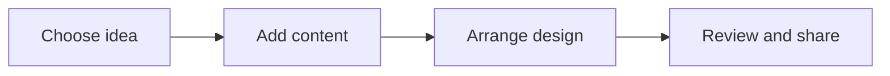

# 🎨 Canva & Digital Creativity

*Grade 6 — Digital Builder*

*How a design comes together*

Topics covered this grade:

- **Visual hierarchy**
- **Infographic design**
- **Campaign communication**
- **Presentation design**
- **Consistent visual identity**

---

### 💡 Visual hierarchy

**Concept:** Visual hierarchy is the arrangement of elements in a way that implies importance, guiding the viewer to the most critical information first.

**Example:** Make your most important text the largest and brightest so it stands out.

**Why it matters:** Learning about visual hierarchy helps you make better choices when you create, communicate, and solve problems with technology. In Grade 6, connect this idea to a small project so you can see it working instead of only memorising a definition.

**Did you know?** A common mix-up is thinking that technology always makes the right choice. People still need to check the result and use good judgement.

---

### ⚙️ Infographic design

*Follow these steps to practise infographic design from start to finish.*

1. **Use 'Negative Space' (empty space) to prevent your design from looking cluttered.** Look for the named button, menu, or result on the screen before continuing.
2. **Pick a consistent set of icons to use throughout your infographic.** Look for the named button, menu, or result on the screen before continuing.
3. **Use lines or arrows to show the 'flow' of information.** Look for the named button, menu, or result on the screen before continuing.
4. **Check your work and correct any mistake.** Compare the result with the task and use Undo or Backspace if something is not right.
5. **Save or finish the activity.** Use the File menu or the activity button, then wait for confirmation that the work is complete.

💡 **Tip:** Work slowly, read each instruction, and ask a teacher before changing a setting you do not recognise.

---

### 💡 Campaign communication

**Concept:** Strategic use of visuals and text to deliver a consistent message across different formats (posters, social media, slides).

**Example:** A campaign for 'Healthy Eating' should use the same colors and logo on the poster and the presentation slides.

**Why it matters:** Learning about campaign communication helps you make better choices when you create, communicate, and solve problems with technology.

**Did you know?** A common mix-up is thinking that technology always makes the right choice. People still need to check the result and use good judgement.

---

### ⚙️ Presentation design

*Follow these steps to practise presentation design from start to finish.*

1. **Use 'Slide Master' to set a consistent look for all your slides at once.** Look for the named button, menu, or result on the screen before continuing.
2. **Incorporate interactive elements like 'Hyperlinks' or 'QR Codes' for your audience.** Look for the named button, menu, or result on the screen before continuing.
3. **Rehearse with your slides so you know exactly when to click to the next one.** Look for the named button, menu, or result on the screen before continuing.
4. **Check your work and correct any mistake.** Compare the result with the task and use Undo or Backspace if something is not right.
5. **Save or finish the activity.** Use the File menu or the activity button, then wait for confirmation that the work is complete.

💡 **Tip:** Work slowly, read each instruction, and ask a teacher before changing a setting you do not recognise.

---

### 💡 Consistent visual identity

**Concept:** A visual identity is the collection of visual elements that represent a brand or project, such as its logo, colors, and fonts.

**Example:** Companies like Apple or Nike have very strong visual identities that make them easy to recognize.

**Why it matters:** Learning about consistent visual identity helps you make better choices when you create, communicate, and solve problems with technology.

**Did you know?** A common mix-up is thinking that technology always makes the right choice. People still need to check the result and use good judgement.

## Review

<FlashcardDeck cards={[{"front":"Visual hierarchy","back":"Visual hierarchy is the arrangement of elements in a way that implies importance, guiding the viewer to the most critical information first."},{"front":"Campaign communication","back":"Strategic use of visuals and text to deliver a consistent message across different formats (posters, social media, slides)."},{"front":"Consistent visual identity","back":"A visual identity is the collection of visual elements that represent a brand or project, such as its logo, colors, and fonts."}]} />
