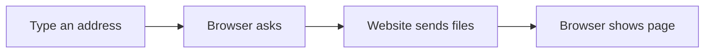

# 🌐 Internet & Digital Citizenship

*Grade 6 — Digital Builder*

*How a webpage reaches your screen*

Topics covered this grade:

- **Research strategies; source evaluation**
- **Misinformation**
- **Privacy; scams**
- **Digital footprint**
- **Ethical digital behavior**

---

### ⚙️ Research strategies; source evaluation

*Follow these steps to practise research strategies; source evaluation from start to finish.*

1. **Use 'Boolean Operators' like AND, OR, and NOT to refine your searches.** Look for the named button, menu, or result on the screen before continuing.
2. **Look for the '.gov,' '.edu,' or '.org' extensions to find more reliable sites.** Look for the named button, menu, or result on the screen before continuing.
3. **Cross-check a fact on three different websites to see if they all agree.** Look for the named button, menu, or result on the screen before continuing.
4. **Check your work and correct any mistake.** Compare the result with the task and use Undo or Backspace if something is not right.
5. **Save or finish the activity.** Use the File menu or the activity button, then wait for confirmation that the work is complete.

💡 **Tip:** Work slowly, read each instruction, and ask a teacher before changing a setting you do not recognise.

---

### 💡 Misinformation

**Concept:** Misinformation is false or inaccurate information that is spread, sometimes intentionally to deceive people.

**Example:** A 'Deepfake' video that makes a famous person look like they are saying something they never said is a dangerous form of misinformation.

**Why it matters:** Learning about misinformation helps you make better choices when you create, communicate, and solve problems with technology. In Grade 6, connect this idea to a small project so you can see it working instead of only memorising a definition.

**Did you know?** A common mix-up is thinking that technology always makes the right choice. People still need to check the result and use good judgement.

---

### ⚙️ Privacy; scams

*Follow these steps to practise privacy; scams from start to finish.*

1. **Review the 'App Permissions' on your phone to see which apps are tracking your location.** Look for the named button, menu, or result on the screen before continuing.
2. **Be wary of messages asking for 'Verification Codes' — this is often a sign of a hack.** Look for the named button, menu, or result on the screen before continuing.
3. **Use a 'Guest Network' for your smart devices to keep your main home network safe.** Look for the named button, menu, or result on the screen before continuing.
4. **Check your work and correct any mistake.** Compare the result with the task and use Undo or Backspace if something is not right.
5. **Save or finish the activity.** Use the File menu or the activity button, then wait for confirmation that the work is complete.

💡 **Tip:** Work slowly, read each instruction, and ask a teacher before changing a setting you do not recognise.

---

### 💡 Digital footprint

**Concept:** A positive digital footprint can help you with school applications and future jobs, while a negative one can cause problems.

**Example:** Sharing your projects and achievements online is a great way to build a professional digital footprint.

**Why it matters:** Learning about digital footprint helps you make better choices when you create, communicate, and solve problems with technology. In Grade 6, connect this idea to a small project so you can see it working instead of only memorising a definition.

**Did you know?** A common mix-up is thinking that technology always makes the right choice. People still need to check the result and use good judgement.

---

### 💡 Ethical digital behavior

**Concept:** Ethics in the digital world includes respecting copyright, avoiding cyberbullying, and being honest in your work.

**Example:** If you use a photo from the internet, always give credit to the person who took it.

**Why it matters:** Learning about ethical digital behavior helps you make better choices when you create, communicate, and solve problems with technology. In Grade 6, connect this idea to a small project so you can see it working instead of only memorising a definition.

**Did you know?** A common mix-up is thinking that technology always makes the right choice. People still need to check the result and use good judgement.

## Review

<FlashcardDeck cards={[{"front":"Misinformation","back":"Misinformation is false or inaccurate information that is spread, sometimes intentionally to deceive people."},{"front":"Digital footprint","back":"A positive digital footprint can help you with school applications and future jobs, while a negative one can cause problems."},{"front":"Ethical digital behavior","back":"Ethics in the digital world includes respecting copyright, avoiding cyberbullying, and being honest in your work."}]} />
