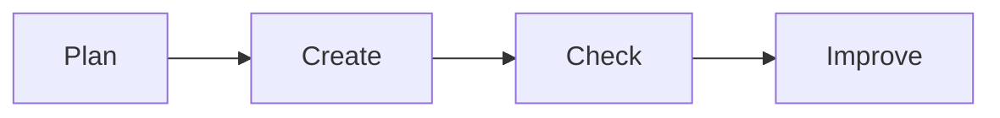

# 📊 Office Productivity

*Grade 6 — Digital Builder*

*A simple digital work cycle*

Topics covered this grade:

- **Project-based documents, presentations and spreadsheets**
- **Charts; data organization**
- **Combining tools to communicate information**

---

### 💡 Project-based documents, presentations and spreadsheets

**Concept:** Applying office tools to complete a single, large project that requires research, data analysis, and presentation.

**Example:** A project on local weather might include a written report (Word), a data table (Excel), and a final presentation (PowerPoint).

**Why it matters:** Learning about project-based documents, presentations and spreadsheets helps you make better choices when you create, communicate, and solve problems with technology.

**Did you know?** A common mix-up is thinking that technology always makes the right choice. People still need to check the result and use good judgement.

---

### ⚙️ Charts; data organization

*Follow these steps to practise charts; data organization from start to finish.*

1. **Choose a 'Line Graph' to show how something changes over time.** Look for the named button, menu, or result on the screen before continuing.
2. **Use 'Sort' and 'Filter' in Excel to find the highest or lowest values in a large list.** Look for the named button, menu, or result on the screen before continuing.
3. **Add labels and a legend to your chart so it is clear and easy to understand.** Look for the named button, menu, or result on the screen before continuing.
4. **Check your work and correct any mistake.** Compare the result with the task and use Undo or Backspace if something is not right.
5. **Save or finish the activity.** Use the File menu or the activity button, then wait for confirmation that the work is complete.

💡 **Tip:** Work slowly, read each instruction, and ask a teacher before changing a setting you do not recognise.

---

### ⚙️ Combining tools to communicate information

*Follow these steps to practise combining tools to communicate information from start to finish.*

1. **Copy a chart from Excel and paste it into your Word report.** Look for the named button, menu, or result on the screen before continuing.
2. **Use the 'Link' option so the chart in Word updates automatically when you change the data in Excel.** Look for the named button, menu, or result on the screen before continuing.
3. **Export your finished report as a PDF so it looks the same on every computer.** Look for the named button, menu, or result on the screen before continuing.
4. **Check your work and correct any mistake.** Compare the result with the task and use Undo or Backspace if something is not right.
5. **Save or finish the activity.** Use the File menu or the activity button, then wait for confirmation that the work is complete.

💡 **Tip:** Work slowly, read each instruction, and ask a teacher before changing a setting you do not recognise.

## Review

<FlashcardDeck cards={[{"front":"Project-based documents, presentations and spreadsheets","back":"Applying office tools to complete a single, large project that requires research, data analysis, and presentation."}]} />
