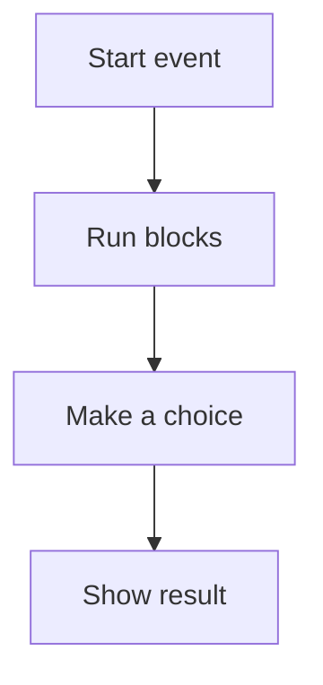

# 🐱 Scratch & Computational Thinking

*Grade 6 — Digital Builder*

*How a Scratch program runs*

Topics covered this grade:

- **Algorithms; flowcharts**
- **Variables; conditions; loops; operators**
- **Custom blocks**
- **Debugging**
- **Multi-level games and interactive projects**

---

### 💡 Algorithms; flowcharts

**Concept:** A flowchart is a visual diagram that shows the steps of an algorithm using shapes and arrows.

**Example:** Drawing a flowchart for your game logic before you start coding helps you avoid mistakes.

**Why it matters:** Learning about algorithms; flowcharts helps you make better choices when you create, communicate, and solve problems with technology. In Grade 6, connect this idea to a small project so you can see it working instead of only memorising a definition.

**Did you know?** A common mix-up is thinking that technology always makes the right choice. People still need to check the result and use good judgement.

---

### 💡 Variables; conditions; loops; operators

**Concept:** Combining these elements allows you to create complex behavior, such as a sprite that moves faster as the score increases.

**Example:** Use a loop with an operator: 'Repeat until Score > 100.'

**Why it matters:** Learning about variables; conditions; loops; operators helps you make better choices when you create, communicate, and solve problems with technology. In Grade 6, connect this idea to a small project so you can see it working instead of only memorising a definition.

**Did you know?** A common mix-up is thinking that technology always makes the right choice. People still need to check the result and use good judgement.

---

### ⚙️ Custom blocks

*Follow these steps to practise custom blocks from start to finish.*

1. **Click 'My Blocks' in the toolbox and then 'Make a Block.'** Look for the named button, menu, or result on the screen before continuing.
2. **Give your block a name like 'Jump' and define the steps (move up, then down).** Look for the named button, menu, or result on the screen before continuing.
3. **Use your new 'Jump' block whenever you need your sprite to leap, making your code cleaner.** Look for the named button, menu, or result on the screen before continuing.
4. **Check your work and correct any mistake.** Compare the result with the task and use Undo or Backspace if something is not right.
5. **Save or finish the activity.** Use the File menu or the activity button, then wait for confirmation that the work is complete.

💡 **Tip:** Work slowly, read each instruction, and ask a teacher before changing a setting you do not recognise.

---

### ⚙️ Debugging

*Follow these steps to practise debugging from start to finish.*

1. **Use 'Dry Running' — step through your code on paper to see if the logic works.** Look for the named button, menu, or result on the screen before continuing.
2. **Look for 'Infinite Loops' that might be causing your program to freeze.** Look for the named button, menu, or result on the screen before continuing.
3. **Use the 'Clean Up Blocks' option to keep your workspace tidy and easy to read.** Look for the named button, menu, or result on the screen before continuing.
4. **Check your work and correct any mistake.** Compare the result with the task and use Undo or Backspace if something is not right.
5. **Save or finish the activity.** Use the File menu or the activity button, then wait for confirmation that the work is complete.

💡 **Tip:** Work slowly, read each instruction, and ask a teacher before changing a setting you do not recognise.

---

### ⚙️ Multi-level games and interactive projects

*Follow these steps to practise multi-level games and interactive projects from start to finish.*

1. **Use a 'Level' variable to track progress.** Look for the named button, menu, or result on the screen before continuing.
2. **Switch to a new backdrop whenever the 'Level' changes.** Look for the named button, menu, or result on the screen before continuing.
3. **Increase the difficulty (e.g., more enemies) as the player moves to higher levels.** Look for the named button, menu, or result on the screen before continuing.
4. **Check your work and correct any mistake.** Compare the result with the task and use Undo or Backspace if something is not right.
5. **Save or finish the activity.** Use the File menu or the activity button, then wait for confirmation that the work is complete.

💡 **Tip:** Work slowly, read each instruction, and ask a teacher before changing a setting you do not recognise.

## Review

<FlashcardDeck cards={[{"front":"Algorithms; flowcharts","back":"A flowchart is a visual diagram that shows the steps of an algorithm using shapes and arrows."},{"front":"Variables; conditions; loops; operators","back":"Combining these elements allows you to create complex behavior, such as a sprite that moves faster as the score increases."}]} />
