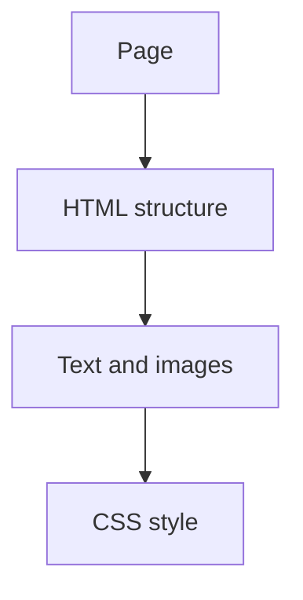

# 🕸️ Web Fundamentals

*Grade 6 — Digital Builder*

*How a webpage is built*

Topics covered this grade:

- **What websites are; webpages vs. websites**
- **HTML structure; headings; paragraphs**
- **Images; links**
- **Introductory CSS**
- **Simple layouts**

---

### 💡 What websites are; webpages vs. websites

**Concept:** A webpage is a single document on the internet, while a website is a collection of related webpages linked together.

**Example:** The 'About Us' page is a webpage; the entire 'Dars-e-Arqam' site is a website.

**Why it matters:** Learning about what websites are; webpages vs. websites helps you make better choices when you create, communicate, and solve problems with technology.

**Did you know?** A common mix-up is thinking that technology always makes the right choice. People still need to check the result and use good judgement.

---

### ⚙️ HTML structure; headings; paragraphs

*Follow these steps to practise html structure; headings; paragraphs from start to finish.*

1. **Start your file with the `<!DOCTYPE html>` tag.** Look for the named button, menu, or result on the screen before continuing.
2. **Use `<h1>` to `<h6>` tags for your titles and subheadings.** Look for the named button, menu, or result on the screen before continuing.
3. **Wrap your main text in `
` tags for paragraphs.** Look for the named button, menu, or result on the screen before continuing.
4. **Check your work and correct any mistake.** Compare the result with the task and use Undo or Backspace if something is not right.
5. **Save or finish the activity.** Use the File menu or the activity button, then wait for confirmation that the work is complete.

💡 **Tip:** Work slowly, read each instruction, and ask a teacher before changing a setting you do not recognise.

---

### ⚙️ Images; links

*Follow these steps to practise images; links from start to finish.*

1. **Use the `` tag with an 'src' attribute to show a picture.** Look for the named button, menu, or result on the screen before continuing.
2. **Use the `<a>` tag with an 'href' attribute to create a link to another page.** Look for the named button, menu, or result on the screen before continuing.
3. **Always include 'alt' text for images so people who can't see them know what they are.** Look for the named button, menu, or result on the screen before continuing.
4. **Check your work and correct any mistake.** Compare the result with the task and use Undo or Backspace if something is not right.
5. **Save or finish the activity.** Use the File menu or the activity button, then wait for confirmation that the work is complete.

💡 **Tip:** Work slowly, read each instruction, and ask a teacher before changing a setting you do not recognise.

---

### 💡 Introductory CSS

**Concept:** CSS (Cascading Style Sheets) is the language used to style and layout webpages, such as changing colors and fonts.

**Example:** Using CSS to make all your `<h1>` headings blue and centered.

**Why it matters:** Learning about introductory css helps you make better choices when you create, communicate, and solve problems with technology. In Grade 6, connect this idea to a small project so you can see it working instead of only memorising a definition.

**Did you know?** A common mix-up is thinking that technology always makes the right choice. People still need to check the result and use good judgement.

---

### ⚙️ Simple layouts

*Follow these steps to practise simple layouts from start to finish.*

1. **Use the `
` tag to group elements together into sections.** Look for the named button, menu, or result on the screen before continuing.
2. **Experiment with 'padding' and 'margin' to add space around your content.** Look for the named button, menu, or result on the screen before continuing.
3. **Use 'text-align: center' to keep your headers and images in the middle of the page.** Look for the named button, menu, or result on the screen before continuing.
4. **Check your work and correct any mistake.** Compare the result with the task and use Undo or Backspace if something is not right.
5. **Save or finish the activity.** Use the File menu or the activity button, then wait for confirmation that the work is complete.

💡 **Tip:** Work slowly, read each instruction, and ask a teacher before changing a setting you do not recognise.

## Review

<FlashcardDeck cards={[{"front":"What websites are; webpages vs. websites","back":"A webpage is a single document on the internet, while a website is a collection of related webpages linked together."},{"front":"Introductory CSS","back":"CSS (Cascading Style Sheets) is the language used to style and layout webpages, such as changing colors and fonts."}]} />
