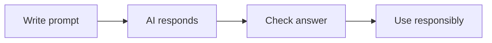

# 🤖 AI Foundations → Advanced AI

*Grade 7 — Digital Innovator*

*A careful AI workflow*

Topics covered this grade:

- **Introduction to AI and generative AI**
- **How AI assistants are used; strengths and limitations**
- **Responsible use**
- **Advanced prompting: context, role, constraints and output formats**
- **Prompt refinement; multi-step prompting**
- **Research and source verification**
- **AI-assisted writing, design and coding**
- **Hallucinations; privacy; copyright; bias**
- **Evaluating AI output**
- **Core tools: an AI assistant, Canva AI and one research/learning AI tool**

---

### 💡 Introduction to AI and generative AI

**Concept:** Exploring the history of AI and how 'Large Language Models' (LLMs) are trained on massive datasets to predict human-like responses.

**Example:** Understanding that ChatGPT doesn't 'think' but uses probability to find the best next word.

**Why it matters:** Learning about introduction to ai and generative ai helps you make better choices when you create, communicate, and solve problems with technology.

**Did you know?** A common mix-up is thinking that technology always makes the right choice. People still need to check the result and use good judgement.

---

### 💡 How AI assistants are used; strengths and limitations

**Concept:** Strategic use of AI as a mentor, tutor, and creative partner while being aware of its 'Hallucinations.'

**Example:** An AI is great for summarizing a book but bad at solving a brand-new, complex logic puzzle.

**Why it matters:** Learning about how ai assistants are used; strengths and limitations helps you make better choices when you create, communicate, and solve problems with technology.

**Did you know?** A common mix-up is thinking that technology always makes the right choice. People still need to check the result and use good judgement.

---

### 💡 Responsible use

**Concept:** Ethical considerations including academic integrity, data privacy, and the environmental impact of training large AI models.

**Example:** Always disclosing your AI use in your school projects and not using AI to create harmful content.

**Why it matters:** Learning about responsible use helps you make better choices when you create, communicate, and solve problems with technology. In Grade 7, connect this idea to a small project so you can see it working instead of only memorising a definition.

**Did you know?** A common mix-up is thinking that technology always makes the right choice. People still need to check the result and use good judgement.

---

### ⚙️ Advanced prompting: context, role, constraints and output formats

*Follow these steps to practise advanced prompting: context, role, constraints and output formats from start to finish.*

1. **Role: 'Act as a senior software engineer.'** Look for the named button, menu, or result on the screen before continuing.
2. **Context: 'I am building a website for a local bakery.'** Look for the named button, menu, or result on the screen before continuing.
3. **Constraint: 'Write the code in clean, commented HTML/CSS only.'** Look for the named button, menu, or result on the screen before continuing.
4. **Output: 'Provide the code blocks followed by a brief explanation of each section.'** Look for the named button, menu, or result on the screen before continuing.
5. **Save or finish the activity.** Use the File menu or the activity button, then wait for confirmation that the work is complete.

💡 **Tip:** Work slowly, read each instruction, and ask a teacher before changing a setting you do not recognise.

---

### ⚙️ Prompt refinement; multi-step prompting

*Follow these steps to practise prompt refinement; multi-step prompting from start to finish.*

1. **Start with a broad request, then use 'Follow-up Prompts' to narrow it down.** Look for the named button, menu, or result on the screen before continuing.
2. **Ask the AI to 'Review your own work and suggest improvements' for a better final result.** Look for the named button, menu, or result on the screen before continuing.
3. **Use 'Chain of Thought' prompting: 'Think step-by-step to solve this problem.'** Look for the named button, menu, or result on the screen before continuing.
4. **Check your work and correct any mistake.** Compare the result with the task and use Undo or Backspace if something is not right.
5. **Save or finish the activity.** Use the File menu or the activity button, then wait for confirmation that the work is complete.

💡 **Tip:** Work slowly, read each instruction, and ask a teacher before changing a setting you do not recognise.

---

### ⚙️ Research and source verification

*Follow these steps to practise research and source verification from start to finish.*

1. **Use AI tools that provide 'Citations' (links to original sources) for every claim.** Look for the named button, menu, or result on the screen before continuing.
2. **Verify the AI's citations — sometimes AI can 'Hallucinate' (make up) fake links.** Look for the named button, menu, or result on the screen before continuing.
3. **Compare AI summaries with the original source text to ensure accuracy.** Look for the named button, menu, or result on the screen before continuing.
4. **Check your work and correct any mistake.** Compare the result with the task and use Undo or Backspace if something is not right.
5. **Save or finish the activity.** Use the File menu or the activity button, then wait for confirmation that the work is complete.

💡 **Tip:** Work slowly, read each instruction, and ask a teacher before changing a setting you do not recognise.

---

### 💡 AI-assisted writing, design and coding

**Concept:** Integrating AI into your professional workflow to speed up repetitive tasks while maintaining your own creative control.

**Example:** Using AI to 'Refactor' (clean up) your Scratch logic or generate a starting outline for a 1000-word essay.

**Why it matters:** Learning about ai-assisted writing, design and coding helps you make better choices when you create, communicate, and solve problems with technology.

**Did you know?** A common mix-up is thinking that technology always makes the right choice. People still need to check the result and use good judgement.

---

### 💡 Hallucinations; privacy; copyright; bias

**Concept:** The critical risks of AI: 'Hallucinations' (false facts), 'Bias' (unfairness in the data), and 'Copyright' (using artists' work without permission).

**Example:** An AI might confidently state that a person died on a certain date even if they are still alive.

**Why it matters:** Learning about hallucinations; privacy; copyright; bias helps you make better choices when you create, communicate, and solve problems with technology.

**Did you know?** A common mix-up is thinking that technology always makes the right choice. People still need to check the result and use good judgement.

---

### ⚙️ Evaluating AI output

*Follow these steps to practise evaluating ai output from start to finish.*

1. **Check for 'Internal Consistency' — does the AI contradict itself in the same answer?** Look for the named button, menu, or result on the screen before continuing.
2. **Look for 'Biased Language' — is the AI favoring one perspective over another?** Look for the named button, menu, or result on the screen before continuing.
3. **Determine the 'Reliability Score' of the AI's answer based on your own research.** Look for the named button, menu, or result on the screen before continuing.
4. **Check your work and correct any mistake.** Compare the result with the task and use Undo or Backspace if something is not right.
5. **Save or finish the activity.** Use the File menu or the activity button, then wait for confirmation that the work is complete.

💡 **Tip:** Work slowly, read each instruction, and ask a teacher before changing a setting you do not recognise.

---

### 💡 Core tools: an AI assistant, Canva AI and one research/learning AI tool

**Concept:** Mastering a suite of professional AI tools and knowing when to switch between them for maximum impact.

**Example:** Use Gemini for coding help, Magic Media for high-end design, and Elicit or Perplexity for academic research.

**Why it matters:** Learning about core tools: an ai assistant, canva ai and one research/learning ai tool helps you make better choices when you create, communicate, and solve problems with technology.

**Did you know?** A common mix-up is thinking that technology always makes the right choice. People still need to check the result and use good judgement.

## Review

<FlashcardDeck cards={[{"front":"Introduction to AI and generative AI","back":"Exploring the history of AI and how 'Large Language Models' (LLMs) are trained on massive datasets to predict human-like responses."},{"front":"How AI assistants are used; strengths and limitations","back":"Strategic use of AI as a mentor, tutor, and creative partner while being aware of its 'Hallucinations."},{"front":"Responsible use","back":"Ethical considerations including academic integrity, data privacy, and the environmental impact of training large AI models."},{"front":"AI-assisted writing, design and coding","back":"Integrating AI into your professional workflow to speed up repetitive tasks while maintaining your own creative control."},{"front":"Hallucinations; privacy; copyright; bias","back":"The critical risks of AI: 'Hallucinations' (false facts), 'Bias' (unfairness in the data), and 'Copyright' (using artists' work without permission)."},{"front":"Core tools: an AI assistant, Canva AI and one research/learning AI tool","back":"Mastering a suite of professional AI tools and knowing when to switch between them for maximum impact."}]} />
