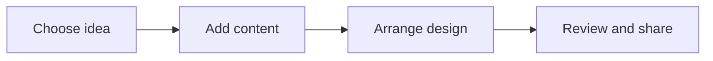

# 🎨 Canva & Digital Creativity

*Grade 7 — Digital Innovator*

*How a design comes together*

Topics covered this grade:

- **Professional visual hierarchy**
- **Typography and color**
- **Infographics**
- **Presentation storytelling**
- **Campaign and project design**

---

### 💡 Professional visual hierarchy

**Concept:** Using advanced principles like the 'Rule of Thirds' and 'Leading Lines' to create professional-grade compositions.

**Example:** Aligning your most important graphic on one of the grid intersections to make it naturally more appealing.

**Why it matters:** Learning about professional visual hierarchy helps you make better choices when you create, communicate, and solve problems with technology. In Grade 7, connect this idea to a small project so you can see it working instead of only memorising a definition.

**Did you know?** A common mix-up is thinking that technology always makes the right choice. People still need to check the result and use good judgement.

---

### ⚙️ Typography and color

*Follow these steps to practise typography and color from start to finish.*

1. **Use 'Color Theory' to pick 'Complementary' or 'Analogous' colors that work together.** Look for the named button, menu, or result on the screen before continuing.
2. **Adjust the 'Kerning' (space between letters) and 'Leading' (space between lines) for better readability.** Look for the named button, menu, or result on the screen before continuing.
3. **Pair a 'Display' font for titles with a highly readable 'Body' font for paragraphs.** Look for the named button, menu, or result on the screen before continuing.
4. **Check your work and correct any mistake.** Compare the result with the task and use Undo or Backspace if something is not right.
5. **Save or finish the activity.** Use the File menu or the activity button, then wait for confirmation that the work is complete.

💡 **Tip:** Work slowly, read each instruction, and ask a teacher before changing a setting you do not recognise.

---

### ⚙️ Infographics

*Follow these steps to practise infographics from start to finish.*

1. **Tell a 'Data Story' by choosing the most surprising or important facts to highlight.** Look for the named button, menu, or result on the screen before continuing.
2. **Use 'Visual Metaphors' (like a growing tree for progress) to explain complex ideas.** Look for the named button, menu, or result on the screen before continuing.
3. **Ensure your infographic has a clear 'Call to Action' at the end.** Look for the named button, menu, or result on the screen before continuing.
4. **Check your work and correct any mistake.** Compare the result with the task and use Undo or Backspace if something is not right.
5. **Save or finish the activity.** Use the File menu or the activity button, then wait for confirmation that the work is complete.

💡 **Tip:** Work slowly, read each instruction, and ask a teacher before changing a setting you do not recognise.

---

### 💡 Presentation storytelling

**Concept:** Moving beyond just slides to using narrative techniques to engage and persuade an audience.

**Example:** Starting your presentation with a personal story or a 'Hook' that grabs everyone's attention.

**Why it matters:** Learning about presentation storytelling helps you make better choices when you create, communicate, and solve problems with technology. In Grade 7, connect this idea to a small project so you can see it working instead of only memorising a definition.

**Did you know?** A common mix-up is thinking that technology always makes the right choice. People still need to check the result and use good judgement.

---

### ⚙️ Campaign and project design

*Follow these steps to practise campaign and project design from start to finish.*

1. **Create a 'Brand Guide' with your chosen hex codes, font names, and logo variations.** Look for the named button, menu, or result on the screen before continuing.
2. **Design a consistent 'Multi-Channel' campaign that includes a poster, a website banner, and a presentation.** Look for the named button, menu, or result on the screen before continuing.
3. **Use Canva's 'Content Planner' to schedule when your designs should be shared.** Look for the named button, menu, or result on the screen before continuing.
4. **Check your work and correct any mistake.** Compare the result with the task and use Undo or Backspace if something is not right.
5. **Save or finish the activity.** Use the File menu or the activity button, then wait for confirmation that the work is complete.

💡 **Tip:** Work slowly, read each instruction, and ask a teacher before changing a setting you do not recognise.

## Review

<FlashcardDeck cards={[{"front":"Professional visual hierarchy","back":"Using advanced principles like the 'Rule of Thirds' and 'Leading Lines' to create professional-grade compositions."},{"front":"Presentation storytelling","back":"Moving beyond just slides to using narrative techniques to engage and persuade an audience."}]} />
