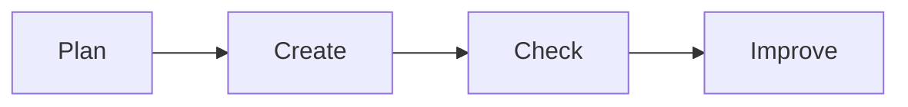

# 🖥️ Computer Foundations

*Grade 7 — Digital Innovator*

*A simple digital work cycle*

Topics covered this grade:

- **Computer systems and components**
- **Operating systems**
- **Efficient file management**
- **Troubleshooting**
- **Security awareness**
- **Digital productivity**

---

### 💡 Computer systems and components

**Concept:** A deep dive into how specialized hardware like GPUs and SSDs impact performance for gaming, design, and AI.

**Example:** An SSD (Solid State Drive) is much faster than a traditional Hard Drive, helping apps load instantly.

**Why it matters:** Learning about computer systems and components helps you make better choices when you create, communicate, and solve problems with technology.

**Did you know?** A common mix-up is thinking that technology always makes the right choice. People still need to check the result and use good judgement.

---

### 💡 Operating systems

**Concept:** Comparing how different operating systems handle permissions, file systems, and user privacy.

**Example:** Linux is often used by developers because it is open-source and very customizable.

**Why it matters:** Learning about operating systems helps you make better choices when you create, communicate, and solve problems with technology. In Grade 7, connect this idea to a small project so you can see it working instead of only memorising a definition.

**Did you know?** A common mix-up is thinking that technology always makes the right choice. People still need to check the result and use good judgement.

---

### ⚙️ Efficient file management

*Follow these steps to practise efficient file management from start to finish.*

1. **Use 'Cloud Storage' (like Google Drive or OneDrive) to sync your files across different devices.** Look for the named button, menu, or result on the screen before continuing.
2. **Set up 'Version Control' for your big projects by saving copies with dates (e.g., Project_v2026_08_21).** Look for the named button, menu, or result on the screen before continuing.
3. **Use file compression (ZIP files) to send large projects over email or the web.** Look for the named button, menu, or result on the screen before continuing.
4. **Check your work and correct any mistake.** Compare the result with the task and use Undo or Backspace if something is not right.
5. **Save or finish the activity.** Use the File menu or the activity button, then wait for confirmation that the work is complete.

💡 **Tip:** Work slowly, read each instruction, and ask a teacher before changing a setting you do not recognise.

---

### ⚙️ Troubleshooting

*Follow these steps to practise troubleshooting from start to finish.*

1. **Use the 'Task Manager' (Windows) or 'Activity Monitor' (Mac) to find apps that are using too much CPU or RAM.** Look for the named button, menu, or result on the screen before continuing.
2. **Learn to read 'Log Files' to find the specific cause of a system crash.** Look for the named button, menu, or result on the screen before continuing.
3. **Practice 'Safe Mode' booting to fix problems when the computer won't start normally.** Look for the named button, menu, or result on the screen before continuing.
4. **Check your work and correct any mistake.** Compare the result with the task and use Undo or Backspace if something is not right.
5. **Save or finish the activity.** Use the File menu or the activity button, then wait for confirmation that the work is complete.

💡 **Tip:** Work slowly, read each instruction, and ask a teacher before changing a setting you do not recognise.

---

### 💡 Security awareness

**Concept:** Security awareness is the knowledge and attitude students have regarding the protection of their digital assets.

**Example:** Being able to spot a 'Zero-Day Vulnerability' or knowing why you shouldn't use public Wi-Fi for banking.

**Why it matters:** Learning about security awareness helps you make better choices when you create, communicate, and solve problems with technology. In Grade 7, connect this idea to a small project so you can see it working instead of only memorising a definition.

**Did you know?** A common mix-up is thinking that technology always makes the right choice. People still need to check the result and use good judgement.

---

### 💡 Digital productivity

**Concept:** Digital productivity is about using technology strategically to manage your time, focus, and output effectively.

**Example:** Using 'Focus Mode' on your laptop to block distractions while you work on your final project.

**Why it matters:** Learning about digital productivity helps you make better choices when you create, communicate, and solve problems with technology. In Grade 7, connect this idea to a small project so you can see it working instead of only memorising a definition.

**Did you know?** A common mix-up is thinking that technology always makes the right choice. People still need to check the result and use good judgement.

## Review

<FlashcardDeck cards={[{"front":"Computer systems and components","back":"A deep dive into how specialized hardware like GPUs and SSDs impact performance for gaming, design, and AI."},{"front":"Operating systems","back":"Comparing how different operating systems handle permissions, file systems, and user privacy."},{"front":"Security awareness","back":"Security awareness is the knowledge and attitude students have regarding the protection of their digital assets."},{"front":"Digital productivity","back":"Digital productivity is about using technology strategically to manage your time, focus, and output effectively."}]} />
