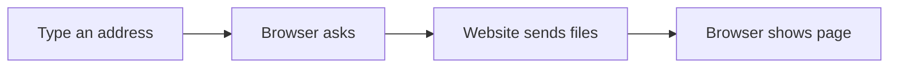

# 🌐 Internet & Digital Citizenship

*Grade 7 — Digital Innovator*

*How a webpage reaches your screen*

Topics covered this grade:

- **Advanced search strategies**
- **Source verification**
- **Misinformation and manipulation**
- **Privacy; scams**
- **Digital footprint**
- **Copyright and responsible digital participation**

---

### ⚙️ Advanced search strategies

*Follow these steps to practise advanced search strategies from start to finish.*

1. **Use 'filetype:pdf' to find specific document types or 'site:.gov' to search only government websites.** Look for the named button, menu, or result on the screen before continuing.
2. **Use the 'Tools' menu in Google to filter results by date or location.** Look for the named button, menu, or result on the screen before continuing.
3. **Search for 'Similar Pages' to find more sources on the same topic.** Look for the named button, menu, or result on the screen before continuing.
4. **Check your work and correct any mistake.** Compare the result with the task and use Undo or Backspace if something is not right.
5. **Save or finish the activity.** Use the File menu or the activity button, then wait for confirmation that the work is complete.

💡 **Tip:** Work slowly, read each instruction, and ask a teacher before changing a setting you do not recognise.

---

### ⚙️ Source verification

*Follow these steps to practise source verification from start to finish.*

1. **Use 'Lateral Reading' — open new tabs to see what other sources say about the website you are on.** Look for the named button, menu, or result on the screen before continuing.
2. **Check the 'About Us' page for clear funding or bias.** Look for the named button, menu, or result on the screen before continuing.
3. **Use 'Reverse Image Search' to see if a photo has been used in a different context before.** Look for the named button, menu, or result on the screen before continuing.
4. **Check your work and correct any mistake.** Compare the result with the task and use Undo or Backspace if something is not right.
5. **Save or finish the activity.** Use the File menu or the activity button, then wait for confirmation that the work is complete.

💡 **Tip:** Work slowly, read each instruction, and ask a teacher before changing a setting you do not recognise.

---

### 💡 Misinformation and manipulation

**Concept:** Understanding how algorithms and 'Echo Chambers' can reinforce false beliefs and how to resist digital manipulation.

**Example:** Knowing that social media feeds are designed to show you things you already agree with, which can hide the truth.

**Why it matters:** Learning about misinformation and manipulation helps you make better choices when you create, communicate, and solve problems with technology.

**Did you know?** A common mix-up is thinking that technology always makes the right choice. People still need to check the result and use good judgement.

---

### ⚙️ Privacy; scams

*Follow these steps to practise privacy; scams from start to finish.*

1. **Learn about 'End-to-End Encryption' and why it is important for private messaging.** Look for the named button, menu, or result on the screen before continuing.
2. **Identify 'Dark Patterns' — design tricks that make you sign up for things or spend money by mistake.** Look for the named button, menu, or result on the screen before continuing.
3. **Set up a 'Security Key' for your most important accounts.** Look for the named button, menu, or result on the screen before continuing.
4. **Check your work and correct any mistake.** Compare the result with the task and use Undo or Backspace if something is not right.
5. **Save or finish the activity.** Use the File menu or the activity button, then wait for confirmation that the work is complete.

💡 **Tip:** Work slowly, read each instruction, and ask a teacher before changing a setting you do not recognise.

---

### 💡 Digital footprint

**Concept:** Managing your online reputation proactively to ensure it reflects your best self for college and career opportunities.

**Example:** A LinkedIn profile or a digital portfolio website is a great way to showcase your Grade 7 projects.

**Why it matters:** Learning about digital footprint helps you make better choices when you create, communicate, and solve problems with technology. In Grade 7, connect this idea to a small project so you can see it working instead of only memorising a definition.

**Did you know?** A common mix-up is thinking that technology always makes the right choice. People still need to check the result and use good judgement.

---

### 💡 Copyright and responsible digital participation

**Concept:** Understanding 'Fair Use,' 'Creative Commons,' and the legal aspects of using other people's digital work.

**Example:** Using 'Creative Commons Attribution' to correctly credit a piece of music you used in your video.

**Why it matters:** Learning about copyright and responsible digital participation helps you make better choices when you create, communicate, and solve problems with technology.

**Did you know?** A common mix-up is thinking that technology always makes the right choice. People still need to check the result and use good judgement.

## Review

<FlashcardDeck cards={[{"front":"Misinformation and manipulation","back":"Understanding how algorithms and 'Echo Chambers' can reinforce false beliefs and how to resist digital manipulation."},{"front":"Digital footprint","back":"Managing your online reputation proactively to ensure it reflects your best self for college and career opportunities."},{"front":"Copyright and responsible digital participation","back":"Understanding 'Fair Use,' 'Creative Commons,' and the legal aspects of using other people's digital work."}]} />
