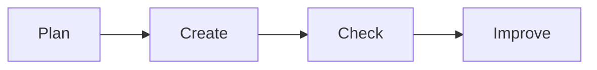

# 📊 Office Productivity

*Grade 7 — Digital Innovator*

*A simple digital work cycle*

Topics covered this grade:

- **Strategic use of documents, presentations and spreadsheets for research, data and project communication**
- **Charts and structured information**

---

### 💡 Strategic use of documents, presentations and spreadsheets for research, data and project communication

**Concept:** Choosing and mastering office tools to deliver high-impact, professional-quality work for any academic or real-world scenario.

**Example:** Using 'Mail Merge' to create personalized letters or 'Data Validation' to make an error-free spreadsheet.

**Why it matters:** Learning about strategic use of documents, presentations and spreadsheets for research, data and project communication helps you make better choices when you create, communicate, and solve problems with technology.

**Did you know?** A common mix-up is thinking that technology always makes the right choice. People still need to check the result and use good judgement.

---

### ⚙️ Charts and structured information

*Follow these steps to practise charts and structured information from start to finish.*

1. **Create 'Pivot Tables' in Excel to summarize thousands of rows of data in seconds.** Look for the named button, menu, or result on the screen before continuing.
2. **Use 'Trendlines' in your charts to predict future values based on current data.** Look for the named button, menu, or result on the screen before continuing.
3. **Use 'Interactive Dashboards' in Google Sheets to show multiple charts that update together.** Look for the named button, menu, or result on the screen before continuing.
4. **Check your work and correct any mistake.** Compare the result with the task and use Undo or Backspace if something is not right.
5. **Save or finish the activity.** Use the File menu or the activity button, then wait for confirmation that the work is complete.

💡 **Tip:** Work slowly, read each instruction, and ask a teacher before changing a setting you do not recognise.

## Review

<FlashcardDeck cards={[{"front":"Strategic use of documents, presentations and spreadsheets for research, data and project communication","back":"Choosing and mastering office tools to deliver high-impact, professional-quality work for any academic or real-world scenario."}]} />
