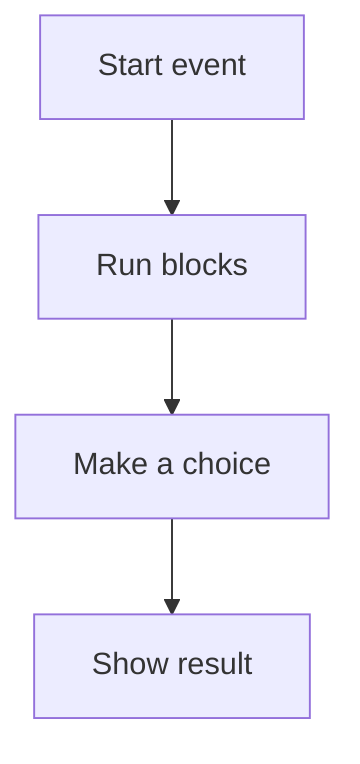

# 🐱 Scratch & Computational Thinking

*Grade 7 — Digital Innovator*

*How a Scratch program runs*

Topics covered this grade:

- **Algorithms; flowcharts**
- **Variables; conditions; loops; operators**
- **Custom blocks**
- **Debugging**
- **Project planning**
- **More complex game mechanics**

---

### 💡 Algorithms; flowcharts

**Concept:** Designing complex, multi-path algorithms and documenting them with detailed flowcharts before implementation.

**Example:** A flowchart for a platformer game that includes jumping, gravity, and collision detection.

**Why it matters:** Learning about algorithms; flowcharts helps you make better choices when you create, communicate, and solve problems with technology. In Grade 7, connect this idea to a small project so you can see it working instead of only memorising a definition.

**Did you know?** A common mix-up is thinking that technology always makes the right choice. People still need to check the result and use good judgement.

---

### 💡 Variables; conditions; loops; operators

**Concept:** Mastering the interplay of these elements to create dynamic systems, like a game shop with changing prices.

**Example:** Using 'Global Variables' to track data across multiple sprites and levels.

**Why it matters:** Learning about variables; conditions; loops; operators helps you make better choices when you create, communicate, and solve problems with technology. In Grade 7, connect this idea to a small project so you can see it working instead of only memorising a definition.

**Did you know?** A common mix-up is thinking that technology always makes the right choice. People still need to check the result and use good judgement.

---

### ⚙️ Custom blocks

*Follow these steps to practise custom blocks from start to finish.*

1. **Use custom blocks with 'Inputs' (parameters) to make your code reusable.** Look for the named button, menu, or result on the screen before continuing.
2. **Create a block like 'Jump [Height]' so you can make your sprite jump different distances with one block.** Look for the named button, menu, or result on the screen before continuing.
3. **Tick 'Run without screen refresh' for custom blocks that need to happen instantly, like drawing a complex shape.** Look for the named button, menu, or result on the screen before continuing.
4. **Check your work and correct any mistake.** Compare the result with the task and use Undo or Backspace if something is not right.
5. **Save or finish the activity.** Use the File menu or the activity button, then wait for confirmation that the work is complete.

💡 **Tip:** Work slowly, read each instruction, and ask a teacher before changing a setting you do not recognise.

---

### ⚙️ Debugging

*Follow these steps to practise debugging from start to finish.*

1. **Implement 'Error Logging' — have your sprites output their state to a list when something goes wrong.** Look for the named button, menu, or result on the screen before continuing.
2. **Learn to recognize 'Logic Errors' — where the code runs fine but doesn't do what you intended.** Look for the named button, menu, or result on the screen before continuing.
3. **Collaborate on 'Peer Reviews' — explain your code to a classmate to find hidden bugs.** Look for the named button, menu, or result on the screen before continuing.
4. **Check your work and correct any mistake.** Compare the result with the task and use Undo or Backspace if something is not right.
5. **Save or finish the activity.** Use the File menu or the activity button, then wait for confirmation that the work is complete.

💡 **Tip:** Work slowly, read each instruction, and ask a teacher before changing a setting you do not recognise.

---

### 💡 Project planning

**Concept:** Using tools like 'Trello' or simple checklists to manage the different tasks in a large software project.

**Example:** Breaking down your final game into 'Assets,' 'Logic,' and 'Testing' phases.

**Why it matters:** Learning about project planning helps you make better choices when you create, communicate, and solve problems with technology. In Grade 7, connect this idea to a small project so you can see it working instead of only memorising a definition.

**Did you know?** A common mix-up is thinking that technology always makes the right choice. People still need to check the result and use good judgement.

---

### ⚙️ More complex game mechanics

*Follow these steps to practise more complex game mechanics from start to finish.*

1. **Implement 'Physics' like acceleration, friction, and momentum.** Look for the named button, menu, or result on the screen before continuing.
2. **Create 'AI Enemies' that follow a path or react to the player's position.** Look for the named button, menu, or result on the screen before continuing.
3. **Use 'Lists' to store and retrieve large amounts of data, like an inventory system or a high-score board.** Look for the named button, menu, or result on the screen before continuing.
4. **Check your work and correct any mistake.** Compare the result with the task and use Undo or Backspace if something is not right.
5. **Save or finish the activity.** Use the File menu or the activity button, then wait for confirmation that the work is complete.

💡 **Tip:** Work slowly, read each instruction, and ask a teacher before changing a setting you do not recognise.

## Review

<FlashcardDeck cards={[{"front":"Algorithms; flowcharts","back":"Designing complex, multi-path algorithms and documenting them with detailed flowcharts before implementation."},{"front":"Variables; conditions; loops; operators","back":"Mastering the interplay of these elements to create dynamic systems, like a game shop with changing prices."},{"front":"Project planning","back":"Using tools like 'Trello' or simple checklists to manage the different tasks in a large software project."}]} />
