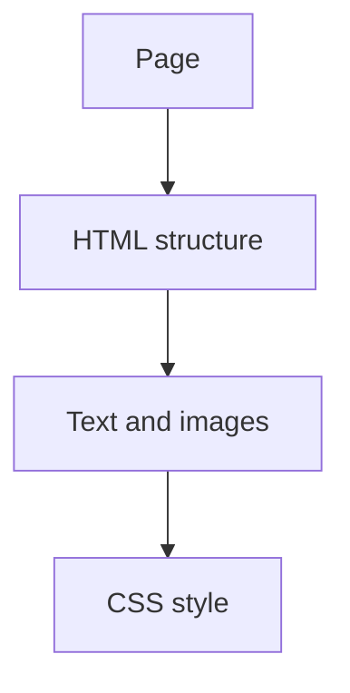

# 🕸️ Web Development Foundations

*Grade 7 — Digital Innovator*

*How a webpage is built*

Topics covered this grade:

- **How websites work**
- **HTML structure; headings; text; images; links**
- **Basic CSS; colors; typography; spacing**
- **Simple layouts**
- **Building and refining a small website**

---

### 💡 How websites work

**Concept:** Understanding the Client-Server model, DNS, and how browsers render HTML, CSS, and JavaScript.

**Example:** When you type a URL, your browser (the client) asks a server for the files, which it then displays.

**Why it matters:** Learning about how websites work helps you make better choices when you create, communicate, and solve problems with technology. In Grade 7, connect this idea to a small project so you can see it working instead of only memorising a definition.

**Did you know?** A common mix-up is thinking that technology always makes the right choice. People still need to check the result and use good judgement.

---

### ⚙️ HTML structure; headings; text; images; links

*Follow these steps to practise html structure; headings; text; images; links from start to finish.*

1. **Use 'Semantic HTML' tags like `<header>`, `<nav>`, `<main>`, and `<footer>` for better structure.** Look for the named button, menu, or result on the screen before continuing.
2. **Organize your project with separate folders for 'css' and 'images.'** Look for the named button, menu, or result on the screen before continuing.
3. **Use 'Relative Paths' (e.g., images/logo.png) so your links work on any computer.** Look for the named button, menu, or result on the screen before continuing.
4. **Check your work and correct any mistake.** Compare the result with the task and use Undo or Backspace if something is not right.
5. **Save or finish the activity.** Use the File menu or the activity button, then wait for confirmation that the work is complete.

💡 **Tip:** Work slowly, read each instruction, and ask a teacher before changing a setting you do not recognise.

---

### ⚙️ Basic CSS; colors; typography; spacing

*Follow these steps to practise basic css; colors; typography; spacing from start to finish.*

1. **Use 'External Stylesheets' to keep your CSS separate from your HTML.** Look for the named button, menu, or result on the screen before continuing.
2. **Master the 'CSS Box Model' — understanding content, padding, border, and margin.** Look for the named button, menu, or result on the screen before continuing.
3. **Use 'Google Fonts' to add professional typography to your site.** Look for the named button, menu, or result on the screen before continuing.
4. **Check your work and correct any mistake.** Compare the result with the task and use Undo or Backspace if something is not right.
5. **Save or finish the activity.** Use the File menu or the activity button, then wait for confirmation that the work is complete.

💡 **Tip:** Work slowly, read each instruction, and ask a teacher before changing a setting you do not recognise.

---

### ⚙️ Simple layouts

*Follow these steps to practise simple layouts from start to finish.*

1. **Use 'CSS Flexbox' to easily align items in rows or columns.** Look for the named button, menu, or result on the screen before continuing.
2. **Apply 'Media Queries' to make your website 'Responsive' (so it looks good on phones too).** Look for the named button, menu, or result on the screen before continuing.
3. **Use 'Opacity' and 'Transitions' to add subtle hover effects to your buttons.** Look for the named button, menu, or result on the screen before continuing.
4. **Check your work and correct any mistake.** Compare the result with the task and use Undo or Backspace if something is not right.
5. **Save or finish the activity.** Use the File menu or the activity button, then wait for confirmation that the work is complete.

💡 **Tip:** Work slowly, read each instruction, and ask a teacher before changing a setting you do not recognise.

---

### ⚙️ Building and refining a small website

*Follow these steps to practise building and refining a small website from start to finish.*

1. **Draft a 'Sitemap' showing how all your pages connect.** Look for the named button, menu, or result on the screen before continuing.
2. **Build a 'Wireframe' of your homepage before you start coding.** Look for the named button, menu, or result on the screen before continuing.
3. **Ask friends to test your site and 'Refine' your layout based on their feedback.** Look for the named button, menu, or result on the screen before continuing.
4. **Check your work and correct any mistake.** Compare the result with the task and use Undo or Backspace if something is not right.
5. **Save or finish the activity.** Use the File menu or the activity button, then wait for confirmation that the work is complete.

💡 **Tip:** Work slowly, read each instruction, and ask a teacher before changing a setting you do not recognise.

## Review

<FlashcardDeck cards={[{"front":"How websites work","back":"Understanding the Client-Server model, DNS, and how browsers render HTML, CSS, and JavaScript."}]} />
